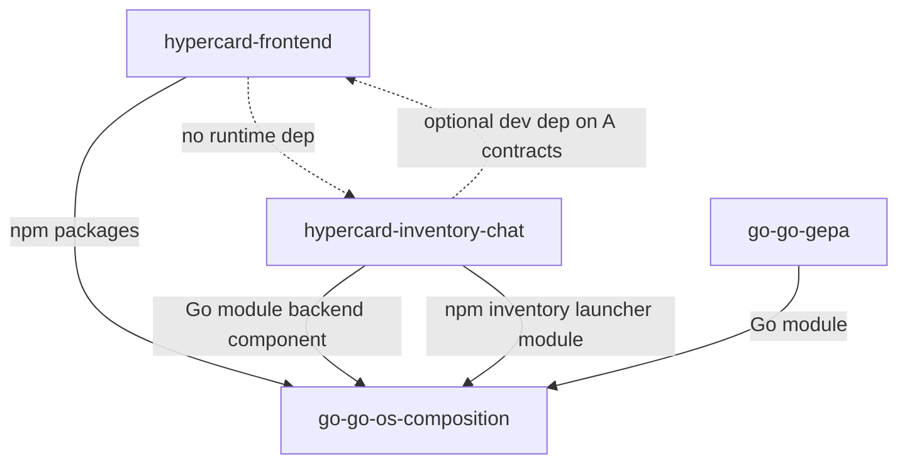
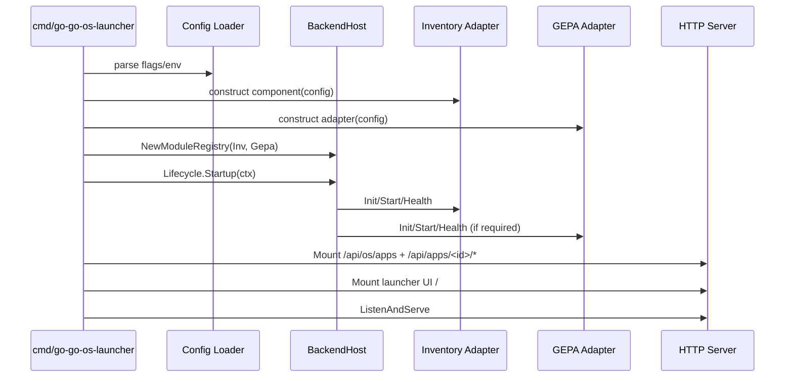
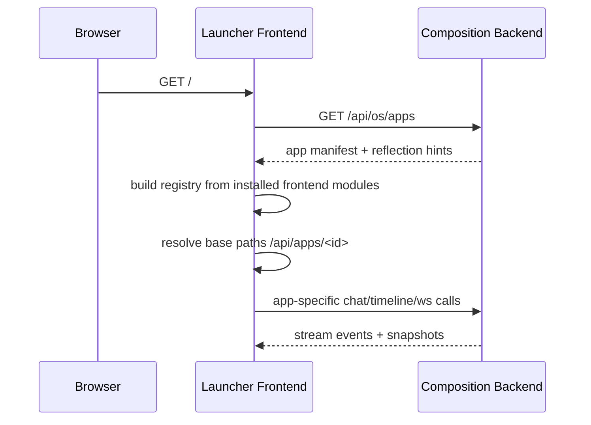

# Repository split blueprint and implementation roadmap

## Executive summary

This document defines a no-compatibility-cut split from the current mixed workspace into three repos:

1. `hypercard-frontend` for the reusable frontend engine and launcher contracts.
2. `hypercard-inventory-chat` for inventory-specific backend and frontend module code.
3. `go-go-os-composition` as the product assembly repo that combines frontend, backend host, inventory module adapters, and GEPA integration.

The end state removes in-repo cross-copy asset syncing, removes monolithic workspace coupling, and enforces an explicit API boundary between the backend host and domain modules. The design keeps one product binary in the composition repo while allowing domain repos to move independently.

No backwards compatibility means we intentionally do not preserve legacy aliases, old route roots, or old build workflows. Consumers must move to the new contracts and new startup sequence.

## Problem statement and scope

### The current problem

The current codebase couples frontend, backend host, and inventory/chat/gepa domain concerns in one repository tree.

Observed evidence:

- `go-go-os` describes itself as a monorepo with frontend packages and `go-inventory-chat` Go backend in the same root (`go-go-os/README.md:53-86`).
- Root scripts run a tightly coupled build chain: frontend build, copy frontend dist into Go embed folder, then Go binary build (`go-go-os/package.json:10-14`, `go-go-os/scripts/sync-launcher-ui.sh:5-18`, `go-go-os/scripts/build-go-go-os-launcher.sh:4-11`).
- Launcher backend currently wires both inventory backend and GEPA module directly in one startup path (`go-go-os/go-inventory-chat/cmd/go-go-os-launcher/main.go:196-237`).
- Inventory routes and chat websocket paths are mounted inside inventory module internals (`go-go-os/go-inventory-chat/cmd/go-go-os-launcher/inventory_backend_module.go:75-101`).
- Frontend host resolves per-app API prefixes using hardcoded namespaced patterns (`go-go-os/apps/os-launcher/src/App.tsx:33-35`, `go-go-os/apps/inventory/src/launcher/module.tsx:51-54`).

This gives strong local productivity but creates split blockers:

- build and release cadence is coupled;
- backend host and domain modules are not versioned independently;
- GEPA integration lives as a host-internal module copy rather than a clear dependency surface;
- frontend package reuse by other repos requires dragging full workspace assumptions.

### Scope of this design

In scope:

- target three-repo architecture and dependency graph;
- no-compatibility migration strategy;
- API contracts (backend and frontend);
- initialization and bootstrap sequence in final composition repo;
- CI/build/release model for all repos.

Out of scope:

- preserving legacy aliases (`/chat`, `/ws`, `/api/timeline`);
- dual-running old and new routes for migration windows;
- detailed UX redesign of launcher windows.

## Current-state architecture (evidence-based)

### Runtime topology today

Backend host currently behaves as follows:

1. Build inventory DB and profile registry.
2. Build webchat server and inventory tools.
3. Build internal GEPA module.
4. Register modules in `ModuleRegistry`.
5. Start lifecycle manager.
6. Mount namespaced routes `/api/apps/<app-id>/*`.
7. Serve embedded launcher UI at `/`.

Evidence:

- startup orchestration and module wiring in `main.go` (`go-go-os/go-inventory-chat/cmd/go-go-os-launcher/main.go:93-260`);
- module lifecycle ordering in `LifecycleManager` (`go-go-os/go-inventory-chat/internal/backendhost/lifecycle.go:23-64`);
- namespaced route mounting and alias guard (`go-go-os/go-inventory-chat/internal/backendhost/routes.go:37-67`);
- module manifest/reflection endpoint (`go-go-os/go-inventory-chat/internal/backendhost/manifest_endpoint.go:30-105`).

### Backend module contract already present

`AppBackendModule` already defines a good internal boundary:

```go
// go-go-os/go-inventory-chat/internal/backendhost/module.go

type AppBackendModule interface {
    Manifest() AppBackendManifest
    MountRoutes(mux *http.ServeMux) error
    Init(ctx context.Context) error
    Start(ctx context.Context) error
    Stop(ctx context.Context) error
    Health(ctx context.Context) error
}
```

This includes an optional reflection interface (`module.go:27-74`) and has enough shape for extraction.

### Frontend module contract already present

`LaunchableAppModule` already defines frontend composition:

```ts
// go-go-os/packages/desktop-os/src/contracts/launchableAppModule.ts

export interface LaunchableAppModule {
  manifest: AppManifest;
  state?: LaunchableAppStateConfig;
  buildLaunchWindow: (ctx: LauncherHostContext, reason: LaunchReason) => OpenWindowPayload;
  createContributions?: (ctx: LauncherHostContext) => DesktopContribution[];
  renderWindow: (params: LaunchableAppRenderParams) => ReactNode | null;
  onRegister?: (ctx: LauncherHostContext) => void;
}
```

Host context carries API resolution hooks (`launcherHostContext.ts:3-9`) and the launcher uses `/api/apps/${appId}` by default (`apps/os-launcher/src/App.tsx:33-35`).

### Coupling points that must be cut

1. Dist copy coupling:
- frontend dist copied into backend embed path (`scripts/sync-launcher-ui.sh:5-18`).

2. Monorepo workspace coupling:
- root workspace scripts and app imports tie all frontend apps together (`go-go-os/package.json:4-22`, `apps/os-launcher/src/app/modules.tsx:1-12`).

3. Domain/backend tight coupling:
- inventory module and GEPA module are created in same command path (`main.go:196-216`).

4. Version skew risk:
- inventory chat and go-go-gepa currently depend on different `geppetto/glazed` versions (`go-inventory-chat/go.mod:6-10`, `go-go-gepa/go.mod:9-11`).

## Target end-state: three-repo split

## Design principles

1. Explicit contracts over shared source tree imports.
2. Independent release cadence with pinned composition versions.
3. One product binary in composition repo.
4. No backwards compatibility: hard cut only.
5. Generic host APIs in composition repo, domain APIs in domain repos.

## Repo A: `hypercard-frontend`

Purpose: reusable frontend platform and launcher framework.

Owns:

- `@hypercard/engine`
- `@hypercard/desktop-os`
- `@hypercard/confirm-runtime`
- launcher shell primitives and shared theme assets
- TypeScript contracts for frontend app modules

Does not own:

- inventory domain frontend state/features
- inventory chat backend routes
- GEPA backend services

Proposed layout:

```text
hypercard-frontend/
  packages/
    engine/
    desktop-os/
    confirm-runtime/
    launcher-shell/
  tooling/
  docs/
  package.json
  pnpm-workspace.yaml
```

Published artifacts:

- npm packages for `@hypercard/*`.
- optional launcher shell static bundle package (for composition embedding).

## Repo B: `hypercard-inventory-chat`

Purpose: inventory domain package with both backend domain services and inventory-specific frontend module.

Owns:

- inventory backend HTTP handlers, domain DB, profile behavior;
- inventory frontend launcher module (`inventoryLauncherModule`) and inventory windows;
- inventory API schema documents and reflection metadata;
- optional standalone dev server for inventory-only development.

Does not own:

- generic backend host runtime registry;
- global launcher frontend shell;
- GEPA runtime host.

Proposed layout:

```text
hypercard-inventory-chat/
  backend/
    internal/inventorydb/
    internal/chatruntime/
    internal/http/
    inventorycomponent/      # host-agnostic inventory backend component
  frontend/
    src/launcher/module.tsx
    src/launcher/renderInventoryApp.tsx
    package.json             # @hypercard/inventory-chat-module
  api/
    openapi.yaml
    schemas/
  cmd/
    inventory-chat-dev/
  go.mod
  package.json
```

Published artifacts:

- Go module with `inventorycomponent` package.
- npm package with `inventoryLauncherModule`.
- API schema bundle.

## Repo C: `go-go-os-composition`

Purpose: final product assembly and runtime composition.

Owns:

- backend host core (`BackendModule` registry, lifecycle, manifest/reflection endpoints);
- launcher binary command and process lifecycle;
- embedding or serving launcher frontend bundle;
- adapters that wrap inventory and GEPA services into `BackendModule` contract;
- product release pipeline.

Depends on:

- Repo A npm packages for frontend runtime.
- Repo B go/npm artifacts for inventory module.
- `go-go-gepa` for GEPA execution integration.

Proposed layout:

```text
go-go-os-composition/
  cmd/go-go-os-launcher/
  internal/backendhost/
  internal/modules/
    inventory/adapter.go
    gepa/adapter.go
  internal/launcherui/
  web/
    os-launcher-app/         # thin host app using frontend packages + domain modules
  scripts/
  go.mod
  package.json
```

## Dependency graph and version ownership



Versioning policy:

1. Repo A: semver tags for frontend package API.
2. Repo B: semver tags for backend component API and frontend module API.
3. Repo C: pins exact versions (go.mod + lockfile) and is the only product release source.

## No-backwards-compatibility cut

This split intentionally breaks old compatibility surfaces.

Hard cuts:

1. No legacy route aliases.
- Keep only namespaced routes `/api/apps/<app-id>/*` (`routes.go:12-16`, `routes.go:59-67`).

2. No old monorepo build command aliases.
- New repos get new local scripts; old root scripts are retired.

3. No implicit in-tree imports.
- Composition imports only published artifacts or explicit workspace overrides.

4. No compatibility shim for old frontend app registration.
- frontend app modules must satisfy current `LaunchableAppModule` contract.

5. No guarantee for old GEPA internal placeholder APIs.
- composition repo defines the new GEPA module adapter contract and route schema.

Migration consequence:

- short-term pain is accepted to reduce long-term architecture debt.

## API design: backend side

## 1) Generic composition host contract

The composition repo keeps a generic host-side contract (evolved from current `AppBackendModule`).

```go
package backendhost

type BackendModuleManifest struct {
    AppID        string   `json:"app_id"`
    Name         string   `json:"name"`
    Description  string   `json:"description,omitempty"`
    Required     bool     `json:"required,omitempty"`
    Capabilities []string `json:"capabilities,omitempty"`
    Version      string   `json:"version,omitempty"`
}

type BackendModule interface {
    Manifest() BackendModuleManifest
    MountRoutes(mux *http.ServeMux) error
    Init(ctx context.Context) error
    Start(ctx context.Context) error
    Stop(ctx context.Context) error
    Health(ctx context.Context) error
}

type ReflectiveBackendModule interface {
    Reflection(ctx context.Context) (*ModuleReflectionDocument, error)
}
```

Rationale:

- already proven in current code (`module.go:17-31`);
- aligned with manifest endpoint (`manifest_endpoint.go:30-105`);
- lifecycle compatible with startup manager (`lifecycle.go:23-83`).

## 2) Inventory backend component contract (repo B)

To avoid cyclic dependency, repo B exports a host-agnostic component contract, not host interface types.

```go
package inventorycomponent

type Component interface {
    AppID() string
    Name() string
    Capabilities() []string

    // Called by composition adapter.
    RegisterHTTP(mux *http.ServeMux) error

    Init(ctx context.Context) error
    Start(ctx context.Context) error
    Stop(ctx context.Context) error
    Health(ctx context.Context) error

    Reflection(ctx context.Context) (*ReflectionDoc, error)
}
```

Composition adapter converts this to `BackendModule`.

Benefits:

- repo B does not import composition repo internals;
- repo C can adapt any module with simple wrapper;
- plugin extraction later is easier.

## 3) GEPA module adapter contract

The composition repo should integrate `go-go-gepa` through a dedicated adapter package and expose namespaced APIs.

```go
package gepamodule

type Runner interface {
    ListScripts(ctx context.Context) ([]ScriptDescriptor, error)
    StartRun(ctx context.Context, req StartRunRequest) (RunRecord, error)
    GetRun(ctx context.Context, runID string) (RunRecord, bool, error)
    CancelRun(ctx context.Context, runID string) (RunRecord, bool, error)
    StreamEvents(ctx context.Context, runID string, afterSeq int64) (<-chan RunEvent, error)
}

type ModuleConfig struct {
    ScriptsRoots []string
    Timeout      time.Duration
    MaxConcurrent int
}
```

Route shape (no compat shims):

- `GET /api/apps/gepa/scripts`
- `POST /api/apps/gepa/runs`
- `GET /api/apps/gepa/runs/{run_id}`
- `POST /api/apps/gepa/runs/{run_id}/cancel`
- `GET /api/apps/gepa/runs/{run_id}/events`
- `GET /api/apps/gepa/runs/{run_id}/timeline`
- `GET /api/apps/gepa/schemas/{schema_id}`

This preserves current successful route model (`go-inventory-chat/README.md:37-43`, `internal/gepa/module.go:81-90`).

## 4) Host discovery and reflection API

Manifest and reflection are first-class and mandatory in composition repo:

- `GET /api/os/apps`
- `GET /api/os/apps/{app_id}/reflection`

The current implementation already supports this (`manifest_endpoint.go:35-105`).

Recommended v2 reflection additions:

- event schemas list;
- CLI/admin docs links;
- deprecation and stability fields;
- auth requirements metadata.

## API design: frontend side

## 1) Frontend app module contract (repo A)

Reuse and stabilize `LaunchableAppModule` (`launchableAppModule.ts:22-29`) and `AppManifest` (`appManifest.ts:26-34`).

```ts
export interface FrontendAppModule {
  manifest: AppManifest;
  state?: LaunchableAppStateConfig;
  buildLaunchWindow: (ctx: LauncherHostContext, reason: LaunchReason) => OpenWindowPayload;
  createContributions?: (ctx: LauncherHostContext) => DesktopContribution[];
  renderWindow: (params: LaunchableAppRenderParams) => ReactNode | null;
}
```

## 2) Frontend host context contract

Keep API resolution explicit and namespaced:

```ts
export interface LauncherHostContext {
  dispatch: (action: unknown) => unknown;
  getState: () => unknown;
  openWindow: (payload: OpenWindowPayload) => void;
  closeWindow: (windowId: string) => void;
  resolveApiBase: (appId: string) => string;
  resolveWsBase: (appId: string) => string;
}
```

Current host sets this to namespaced paths (`apps/os-launcher/src/App.tsx:33-35`), and inventory module consumes it (`apps/inventory/src/launcher/module.tsx:51-54`).

## 3) Frontend-backend route assumptions

Chat runtime currently assumes:

- POST `${basePrefix}/chat`
- GET `${basePrefix}/api/timeline?conv_id=...`
- WS `${basePrefix}/ws?conv_id=...`

Evidence:

- HTTP chat/timeline path construction (`engine/src/chat/runtime/http.ts:51-103`)
- WS path construction (`engine/src/chat/ws/wsManager.ts:71-97`)

In split architecture, this remains valid with `basePrefix=/api/apps/inventory`.

## 4) Dynamic module registration in composition frontend

Composition repo frontend app should avoid hardcoded imports of inventory module source paths. Instead, import versioned package exports.

Current hardcoded modules list (`apps/os-launcher/src/app/modules.tsx:1-12`) becomes:

```ts
import { inventoryLauncherModule } from '@hypercard/inventory-chat-module';
import { todoLauncherModule } from '@hypercard/todo-module';

export const launcherModules = [
  inventoryLauncherModule,
  todoLauncherModule,
];
```

## End-state initialization sequence (composition repo)

## Backend bootstrap sequence



Pseudocode:

```go
func runLauncher(ctx context.Context, cfg Config) error {
    inv := inventoryadapter.New(cfg.Inventory)
    gepa := gepaadapter.New(cfg.GEPA)

    reg, err := backendhost.NewModuleRegistry(inv, gepa)
    if err != nil { return err }

    life := backendhost.NewLifecycleManager(reg)
    if err := life.Startup(ctx, backendhost.StartupOptions{RequiredAppIDs: cfg.RequiredApps}); err != nil {
        return err
    }
    defer life.Stop(context.Background())

    mux := http.NewServeMux()
    backendhost.RegisterAppsManifestEndpoint(mux, reg)
    for _, m := range reg.Modules() {
        _ = backendhost.MountNamespacedRoutes(mux, m.Manifest().AppID, m.MountRoutes)
    }
    mux.Handle("/", launcherui.Handler())

    return http.ListenAndServe(cfg.Addr, mux)
}
```

## Frontend bootstrap sequence



Frontend pseudocode:

```ts
async function bootstrapLauncher() {
  const manifest = await fetch('/api/os/apps').then((r) => r.json());

  const modules = loadInstalledFrontendModules();
  const registry = createAppRegistry(modules);

  const hostContext: LauncherHostContext = {
    dispatch,
    getState,
    openWindow,
    closeWindow,
    resolveApiBase: (appId) => `/api/apps/${appId}`,
    resolveWsBase: (appId) => `/api/apps/${appId}/ws`,
  };

  render(
    <DesktopShell
      contributions={buildLauncherContributions(registry, { hostContext })}
      renderAppWindow={createRenderAppWindow({ registry, hostContext })}
    />,
  );
}
```

## Timeline flow sequence (inventory + GEPA)

```text
User action in window
  -> Frontend module emits command
  -> Chat runtime submits POST /api/apps/inventory/chat
  -> WS stream on /api/apps/inventory/ws emits SEM envelopes
  -> Timeline snapshot hydrates from /api/apps/inventory/api/timeline
  -> Optional GEPA run from /api/apps/gepa/runs
  -> GEPA events feed timeline/debug windows
```

## Build and release model

## Repo A (`hypercard-frontend`) build

Commands:

```bash
pnpm install
pnpm -r build
pnpm -r test
pnpm -r publish --filter @hypercard/*
```

Artifacts:

- versioned npm packages.

## Repo B (`hypercard-inventory-chat`) build

Commands:

```bash
go test ./...
go build ./cmd/inventory-chat-dev
pnpm install
pnpm --filter @hypercard/inventory-chat-module build
pnpm --filter @hypercard/inventory-chat-module test
```

Artifacts:

- Go module tag (backend component package).
- npm package tag (inventory frontend module).
- api schema bundle.

## Repo C (`go-go-os-composition`) build

Commands:

```bash
# frontend host app
pnpm install
pnpm --filter @hypercard/os-launcher-composition build

# sync or embed frontend build for Go binary
bash ./scripts/sync-launcher-ui.sh

# backend binary
go test ./...
go build ./cmd/go-go-os-launcher
```

Product release:

- composition repo creates signed binaries and release notes;
- release notes list pinned dependency versions for repo A/B and `go-go-gepa`.

## CI pipeline design

## Repo A pipeline

1. typecheck
2. lint
3. tests
4. package publish on tag

## Repo B pipeline

1. go lint/test
2. frontend module lint/test/build
3. schema validation
4. publish go tag + npm package on tag

## Repo C pipeline

1. resolve pinned versions
2. build frontend host
3. embed launcher assets
4. build backend launcher
5. smoke test namespaced endpoints and reflection
6. release artifact

Smoke criteria should include:

- `/api/os/apps` healthy manifests;
- `/api/os/apps/{id}/reflection` available where expected;
- `/api/apps/inventory/chat` and `/api/apps/inventory/ws` reachable;
- `/api/apps/gepa/*` run flow reachable.

## Detailed migration plan (no compatibility)

## Phase 0: freeze and contract lock (1 week)

Deliverables:

1. freeze current contracts from `desktop-os` and `backendhost`.
2. write route and reflection schema docs.
3. declare explicit deprecations.

Tasks:

- copy contract snapshots into ADRs;
- add conformance tests in current repo to validate contracts before extraction.

## Phase 1: extract frontend platform repo (2-3 weeks)

Deliverables:

1. new `hypercard-frontend` repo with engine/desktop-os packages.
2. versioned npm publish flow.
3. composition frontend host can import packages by version.

Cut decisions:

- remove workspace-local path imports from composition host;
- no compatibility for old package names if renamed.

## Phase 2: extract inventory chat repo (2-4 weeks)

Deliverables:

1. inventory backend component package (host-agnostic);
2. inventory frontend launcher module npm package;
3. schema bundle and reflection metadata.

Cut decisions:

- inventory backend no longer built from go-go-os root;
- old monorepo build scripts removed.

## Phase 3: composition repo assembly (2-3 weeks)

Deliverables:

1. `go-go-os-composition` with backend host and launcher command.
2. module adapters for inventory and GEPA.
3. frontend host app with imported module packages.

Cut decisions:

- only namespaced routes available;
- only manifest/reflection-driven module discovery supported.

## Phase 4: hard cut and cleanup (1-2 weeks)

Deliverables:

1. old mixed repo paths archived.
2. docs updated to new repos and commands only.
3. rollback plan only at release level (not API compatibility level).

## Concrete implementation checklist

## Backend tasks

1. Create `internal/backendhost` package in composition repo by lifting proven pieces:
- module interface and reflection docs (`module.go`);
- registry (`registry.go`);
- lifecycle (`lifecycle.go`);
- route namespace guard (`routes.go`);
- manifest endpoint (`manifest_endpoint.go`).

2. Write inventory adapter:

```go
type inventoryAdapter struct {
    c inventorycomponent.Component
}

func (a *inventoryAdapter) Manifest() backendhost.BackendModuleManifest {
    return backendhost.BackendModuleManifest{
        AppID: "inventory",
        Name:  "Inventory",
        Required: true,
        Capabilities: a.c.Capabilities(),
    }
}

func (a *inventoryAdapter) MountRoutes(mux *http.ServeMux) error { return a.c.RegisterHTTP(mux) }
func (a *inventoryAdapter) Init(ctx context.Context) error  { return a.c.Init(ctx) }
func (a *inventoryAdapter) Start(ctx context.Context) error { return a.c.Start(ctx) }
func (a *inventoryAdapter) Stop(ctx context.Context) error  { return a.c.Stop(ctx) }
func (a *inventoryAdapter) Health(ctx context.Context) error { return a.c.Health(ctx) }
```

3. Write GEPA adapter around `go-go-gepa` integration path.

4. Add conformance tests per module:
- required `Manifest().AppID` validation;
- health gating behavior;
- reflection endpoint payload shape.

## Frontend tasks

1. Move launcher contracts and registry logic into repo A packages.
2. Publish `@hypercard/inventory-chat-module` from repo B.
3. In composition repo frontend host, consume modules from package imports.
4. Keep base-prefix strategy unchanged:
- `resolveApiBase(appId) => /api/apps/${appId}`;
- `resolveWsBase(appId) => /api/apps/${appId}/ws`.

## API schema and docs tasks

1. Add `schemas/` and docs for each backend module.
2. Reflection payload must enumerate:
- docs,
- APIs,
- schemas,
- capability stability.

3. Add automated check:
- every reflected schema id must resolve by HTTP.

## Risks and mitigation

## Risk 1: version skew between composition and module repos

Observed warning signal already exists in current dependency versions (`go-inventory-chat/go.mod:6-10`, `go-go-gepa/go.mod:9-11`).

Mitigation:

- lock to exact versions in composition release branch;
- run compatibility matrix CI weekly;
- publish contract-test fixtures from composition repo and run them in repo B.

## Risk 2: frontend package churn breaks composition builds

Mitigation:

- semver discipline in repo A;
- compatibility test app in repo C pinned to latest + previous minor.

## Risk 3: hidden route dependencies in existing frontend modules

Mitigation:

- static scan for hardcoded `/chat`, `/ws`, `/api/timeline` without basePrefix;
- mandatory integration tests around `basePrefix` and `resolveWsBase` behavior.

## Risk 4: GEPA adapter mismatch with future plugin extraction

Mitigation:

- keep GEPA adapter internal behind `Runner` interface;
- design event schema now so transport can change later without UI break.

## Testing and validation strategy

## Contract test matrix

1. Backend host conformance tests:
- module registration rejects duplicate/invalid app IDs (`registry.go:14-37`, `routes.go:18-35`).
- lifecycle required module health checks (`lifecycle.go:50-61`).

2. Route tests:
- namespaced route mounting for each module (`routes.go:37-56`).
- legacy aliases return 404 in product binary.

3. Reflection tests:
- `/api/os/apps` includes reflection hint when module supports it (`manifest_endpoint.go:53-58`).
- `/api/os/apps/{id}/reflection` returns expected schema docs.

4. Frontend integration tests:
- launcher resolves modules and renders app windows (`renderAppWindow.ts:14-43`).
- chat runtime works with `basePrefix=/api/apps/inventory` (`http.ts:51-103`, `wsManager.ts:71-97`).

5. E2E smoke tests:
- boot product binary;
- create chat turn;
- run GEPA script;
- verify timeline and event stream windows receive updates.

## Recommended repository creation order

1. Create repo A first and publish baseline frontend packages.
2. Create repo B second and publish inventory backend/frontend module artifacts.
3. Create repo C third and assemble both plus GEPA adapter.
4. Run hard-cut migration and decommission old mixed paths.

This order minimizes circular blockers.

## Open questions to close before implementation

1. GEPA integration mode in phase 1 of composition:
- in-process library adapter vs subprocess wrapper around `gepa-runner`.

2. Frontend distribution in composition:
- embed built static assets into Go binary vs sidecar static hosting.

3. Auth and multi-tenant policy for module endpoints:
- currently assumed local trusted runtime.

4. Whether reflection payload should include machine-readable event schemas for timeline replay.

## References

- Current monorepo architecture and launcher-first flow:
  - `go-go-os/README.md:53-86`
  - `go-go-os/README.md:38-43`
- Root build coupling and frontend->Go embedding:
  - `go-go-os/package.json:10-14`
  - `go-go-os/scripts/sync-launcher-ui.sh:5-18`
  - `go-go-os/scripts/build-go-go-os-launcher.sh:4-11`
  - `go-go-os/go-inventory-chat/internal/launcherui/handler.go:12-22`
- Backend host and module contracts:
  - `go-go-os/go-inventory-chat/internal/backendhost/module.go:17-31`
  - `go-go-os/go-inventory-chat/internal/backendhost/registry.go:14-37`
  - `go-go-os/go-inventory-chat/internal/backendhost/lifecycle.go:23-64`
  - `go-go-os/go-inventory-chat/internal/backendhost/routes.go:37-67`
  - `go-go-os/go-inventory-chat/internal/backendhost/manifest_endpoint.go:30-105`
- Launcher backend wiring and module composition:
  - `go-go-os/go-inventory-chat/cmd/go-go-os-launcher/main.go:196-237`
  - `go-go-os/go-inventory-chat/cmd/go-go-os-launcher/inventory_backend_module.go:75-101`
- GEPA module route and reflection shape:
  - `go-go-os/go-inventory-chat/internal/gepa/module.go:65-210`
  - `go-go-os/go-inventory-chat/README.md:28-43`
- Frontend module and host contracts:
  - `go-go-os/packages/desktop-os/src/contracts/launchableAppModule.ts:22-29`
  - `go-go-os/packages/desktop-os/src/contracts/appManifest.ts:26-34`
  - `go-go-os/apps/os-launcher/src/App.tsx:22-50`
  - `go-go-os/apps/inventory/src/launcher/module.tsx:31-62`
  - `go-go-os/packages/engine/src/chat/runtime/http.ts:51-103`
  - `go-go-os/packages/engine/src/chat/ws/wsManager.ts:71-97`
- Dependency evidence:
  - `go-go-os/go-inventory-chat/go.mod:6-10`
  - `go-go-gepa/go.mod:9-11`
