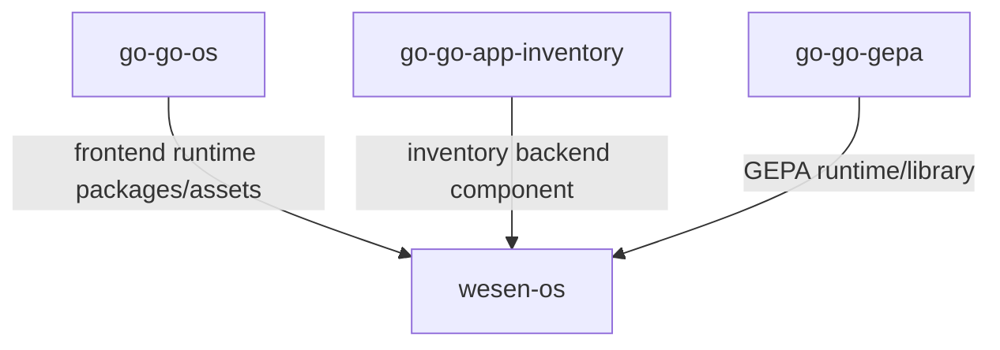
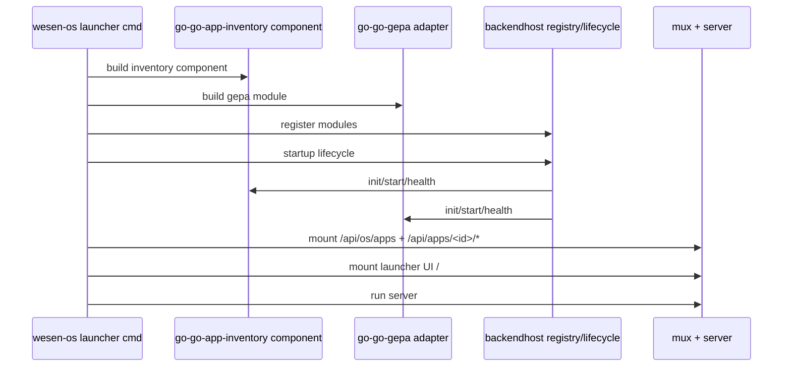

# V2 wesen-os composition plan (go-go-os + go-go-gepa + go-go-app-inventory)

## Executive Summary

This v2 plan updates the previous split design to a new naming and dependency model:

1. `go-go-os` remains the frontend/platform source repo.
2. `go-go-gepa` remains the GEPA source repo.
3. `go-go-app-inventory` becomes the extracted inventory backend repo (from current `go-inventory-chat` backend parts).
4. `wesen-os` is the new composition repo (renamed from `go-go-os-composition`) that assembles all three inputs into one product runtime.

This is a hard cut. No backward compatibility is maintained for old naming, old composition repo naming, or legacy route aliases.

This document includes a detailed implementation task board designed for direct execution.

## Rename and topology delta (v1 -> v2)

## Rename map

- `go-go-os-composition` -> `wesen-os`
- `hypercard-inventory-chat` -> `go-go-app-inventory`

## Topology update

Previous framing in v1 treated a standalone frontend repo and inventory mixed frontend/backend repo. V2 first plan is:

- source repos:
  - `go-go-os`
  - `go-go-gepa`
  - `go-go-app-inventory`
- product composition repo:
  - `wesen-os`

This means `wesen-os` becomes the assembly root for runtime integration, while source repos focus on domain/platform responsibilities.

## Problem Statement

Current state mixes too many responsibilities under `go-go-os`:

- frontend monorepo + launcher app;
- backend host runtime;
- inventory backend implementation;
- GEPA backend module wiring.

Evidence:

- mixed frontend + backend monorepo structure in `go-go-os/README.md:53-86`.
- launcher command directly wires inventory + GEPA modules in one command flow (`go-go-os/go-inventory-chat/cmd/go-go-os-launcher/main.go:196-237`).
- inventory backend routes and profile/timeline/chat wiring are module-local in the same tree (`go-go-os/go-inventory-chat/cmd/go-go-os-launcher/inventory_backend_module.go:61-104`).
- composition route model and backend host contracts already exist but are not separated into a dedicated product repo (`go-go-os/go-inventory-chat/internal/backendhost/*.go`).

The desired v2 state is to separate repository ownership while keeping composition behavior coherent and namespaced.

## Proposed Solution

## Target repository ownership

## Repo 1: `go-go-os`

Purpose in v2 first plan:

- frontend platform and launcher frontend host assets;
- frontend contracts (`desktop-os`, `engine`) and runtime widgets;
- app-side UI modules (including inventory frontend module if not split yet).

Key existing contract evidence:

- `LaunchableAppModule` contract (`go-go-os/packages/desktop-os/src/contracts/launchableAppModule.ts:22-29`)
- launcher host API base resolution (`go-go-os/apps/os-launcher/src/App.tsx:22-35`)

## Repo 2: `go-go-app-inventory`

Purpose in v2 first plan:

- extracted inventory backend implementation currently living in `go-go-os/go-inventory-chat` backend-specific files;
- inventory domain data, tools, request resolver, middleware policy integration, and chat profile behavior;
- no generic backend host runtime ownership.

Initial extraction source set (from current tree):

- move/copy to `go-go-app-inventory`:
  - `internal/inventorydb/*`
  - `internal/pinoweb/*`
  - inventory tool wiring from `cmd/go-go-os-launcher/tools_inventory*.go`
  - inventory app module-specific logic from `cmd/go-go-os-launcher/inventory_backend_module.go` (adapted)
  - `cmd/hypercard-inventory-seed/main.go` (rename to inventory app conventions)

- do not move (owned by `wesen-os` in v2):
  - `internal/backendhost/*`
  - `internal/gepa/*`
  - `internal/launcherui/*`
  - `cmd/go-go-os-launcher/main.go`

## Repo 3: `go-go-gepa`

Purpose in v2 first plan:

- GEPA runtime and script execution capability;
- GEPA CLI and script catalog logic;
- versioned Go module consumed by `wesen-os` through adapter layer.

## Repo 4: `wesen-os` (composition)

Purpose in v2 first plan:

- product runtime composition and release;
- generic backend host (`BackendModule` registry/lifecycle/routes/manifest/reflection);
- adapters for inventory backend component and GEPA backend component;
- launcher command + app lifecycle;
- frontend asset assembly/embedding for single binary deployment.

## Dependency graph



`wesen-os` is the only product release repo.

## Dependency/version matrix (backend split baseline)

This table records the concrete backend split state after B1-B3 implementation commits.

| Consumer | Dependency | Baseline | Notes |
| --- | --- | --- | --- |
| `wesen-os` | `github.com/go-go-golems/go-go-app-inventory` | `v0.0.0-00010101000000-000000000000` + `replace ../go-go-app-inventory` | Local composition workspace pin while extraction stabilizes |
| `wesen-os` | `github.com/go-go-golems/go-go-gepa` | `v0.0.0-20260223022920-190ca45ac964` + `replace ../go-go-gepa` | Uses extracted `pkg/backendmodule` adapter path |
| `wesen-os` | `github.com/go-go-golems/geppetto` | `v0.10.2` | Shared runtime/profiles/middleware contracts |
| `go-go-app-inventory` | `github.com/go-go-golems/pinocchio` | `v0.10.1` | Chat/http handlers and runtime composition interfaces |
| `go-go-app-inventory` | `github.com/go-go-golems/plz-confirm` | `v0.0.4` | Confirm backend route mounting via component API |
| `go-go-gepa` | `github.com/go-go-golems/go-go-goja` | `v0.4.0` | JS execution/runtime integration |

Policy:

1. `wesen-os` owns final tested integration pins.
2. Upstream repos (`go-go-app-inventory`, `go-go-gepa`) can advance independently.
3. `replace` directives are allowed in local integration branches and should be removed/replaced by released tags before release-candidate cuts.

## Design Decisions

1. Keep generic backend runtime in `wesen-os`, not in inventory repo.
2. Extract inventory backend only to `go-go-app-inventory` in first plan.
3. Keep namespaced API policy (`/api/apps/<app-id>/*`) as strict contract.
4. Keep no-backward-compat hard cut (including naming and route aliases).
5. Treat `go-go-os` and `go-go-gepa` as upstream dependencies pinned by `wesen-os`.

## Backend API and module contracts (wesen-os)

`wesen-os` should keep the proven generic host contracts and move them from current location.

Current evidence:

- module interface and reflection contract (`go-go-os/go-inventory-chat/internal/backendhost/module.go:17-31`)
- registry (`.../registry.go:14-37`)
- lifecycle (`.../lifecycle.go:23-64`)
- route namespacing and alias guard (`.../routes.go:37-67`)
- manifest and reflection endpoints (`.../manifest_endpoint.go:30-105`)

Contract sketch:

```go
type BackendModule interface {
    Manifest() BackendModuleManifest
    MountRoutes(mux *http.ServeMux) error
    Init(ctx context.Context) error
    Start(ctx context.Context) error
    Stop(ctx context.Context) error
    Health(ctx context.Context) error
}

type ReflectiveBackendModule interface {
    Reflection(ctx context.Context) (*ModuleReflectionDocument, error)
}
```

## Inventory component contract (`go-go-app-inventory`)

To avoid direct import cycle into `wesen-os` internals, expose host-agnostic inventory backend component:

```go
package inventoryapp

type Component interface {
    AppID() string
    Name() string
    Capabilities() []string

    RegisterHTTP(mux *http.ServeMux) error

    Init(ctx context.Context) error
    Start(ctx context.Context) error
    Stop(ctx context.Context) error
    Health(ctx context.Context) error

    Reflection(ctx context.Context) (*ReflectionDocument, error)
}
```

Then `wesen-os/internal/modules/inventory` adapts `Component` to `BackendModule`.

## GEPA adapter contract (`wesen-os`)

`wesen-os` wraps `go-go-gepa` with a module adapter that exposes:

- script list
- run create/status/cancel
- event stream
- timeline projection
- schemas and reflection

Route envelope stays namespaced under `/api/apps/gepa/*`.

## Frontend integration contract

`wesen-os` frontend host should keep the same base path model already used in `go-go-os`:

- `resolveApiBase(appId) => /api/apps/${appId}`
- `resolveWsBase(appId) => /api/apps/${appId}/ws`

Evidence:

- host context definition: `go-go-os/packages/desktop-os/src/contracts/launcherHostContext.ts:3-9`
- host implementation: `go-go-os/apps/os-launcher/src/App.tsx:33-35`
- inventory module consumption: `go-go-os/apps/inventory/src/launcher/module.tsx:51-54`

## Initialization sequence in wesen-os



Backend pseudocode:

```go
func Run(ctx context.Context, cfg Config) error {
    inventory := inventoryadapter.New(goappinventory.NewComponent(cfg.Inventory))
    gepa := gepaadapter.New(cfg.GEPA)

    reg, err := backendhost.NewModuleRegistry(inventory, gepa)
    if err != nil {
        return err
    }

    life := backendhost.NewLifecycleManager(reg)
    if err := life.Startup(ctx, backendhost.StartupOptions{RequiredAppIDs: cfg.RequiredApps}); err != nil {
        return err
    }
    defer life.Stop(context.Background())

    mux := http.NewServeMux()
    backendhost.RegisterAppsManifestEndpoint(mux, reg)
    for _, m := range reg.Modules() {
        _ = backendhost.MountNamespacedRoutes(mux, m.Manifest().AppID, m.MountRoutes)
    }
    mux.Handle("/", launcherui.Handler())

    return http.ListenAndServe(cfg.Addr, mux)
}
```

## Detailed execution task board

The following is the actionable first-plan task list.

## Track A: Program and naming hard cut

- [ ] A1. Create `wesen-os` repository.
- [ ] A2. Write top-level README with explicit statement: renamed from prior `go-go-os-composition` concept.
- [ ] A3. Write naming ADR documenting:
  - `wesen-os` composition role,
  - `go-go-app-inventory` extraction role,
  - no backward naming aliases.
- [ ] A4. Define semantic versioning and release owner for each repo.
- [ ] A5. Add dependency pin policy doc for `wesen-os`.

Acceptance:

- `wesen-os` exists and bootstraps locally.
- naming ADR merged.

## Track B: Extract inventory backend to `go-go-app-inventory`

## B.1 Repository bootstrap

- [ ] B1. Initialize new Go module `go-go-app-inventory`.
- [ ] B2. Copy `.golangci.yml`, Makefile baseline, and CI scaffold.
- [ ] B3. Add initial README with scope boundaries (backend only in phase 1).

## B.2 Move inventory domain packages

- [ ] B4. Move `internal/inventorydb/*` from `go-go-os/go-inventory-chat`.
- [ ] B5. Move `internal/pinoweb/*` and prompts.
- [ ] B6. Move inventory tools logic from `tools_inventory.go` and tests.
- [ ] B7. Move inventory seeding command (`cmd/hypercard-inventory-seed/main.go`) and rename command as needed.

## B.3 Carve host-agnostic component API

- [ ] B8. Introduce `pkg/inventoryapp/component.go` (or equivalent) with `Component` interface.
- [ ] B9. Implement `NewComponent(opts)` constructor.
- [ ] B10. Implement `RegisterHTTP` route mounting inside component.
- [ ] B11. Implement reflection builder in component.
- [ ] B12. Implement health contract in component.

## B.4 Tests and quality

- [ ] B13. Port unit tests for DB store and resolver.
- [ ] B14. Add component-level route mounting tests.
- [ ] B15. Add reflection payload test.
- [ ] B16. Add lifecycle smoke test (`Init/Start/Health/Stop`).
- [ ] B17. Ensure `go test ./...` passes in new repo.

## B.5 Remove composition ownership from inventory repo

- [ ] B18. Ensure no `backendhost` package ownership in `go-go-app-inventory`.
- [ ] B19. Ensure no GEPA module implementation ownership.
- [ ] B20. Ensure no launcher UI embedding ownership.

Acceptance:

- `go-go-app-inventory` exports a reusable backend component with tests passing.

## Track C: Prepare `go-go-os` as upstream frontend input

## C.1 Frontend packaging boundaries

- [ ] C1. Confirm published/consumable packages for `engine` and `desktop-os`.
- [ ] C2. Ensure launcher host app build artifact can be produced standalone.
- [ ] C3. Document artifact output contract consumed by `wesen-os`.

## C.2 Remove backend assumptions from go-go-os

- [ ] C4. Remove direct `go-inventory-chat` coupling from primary docs/build scripts (or mark deprecated if needed during transition).
- [ ] C5. Add compatibility note that backend now composes in `wesen-os`.

## C.3 Frontend runtime compatibility checks

- [ ] C6. Verify basePrefix-driven runtime assumptions remain stable:
  - chat POST `/chat`,
  - ws `/ws`,
  - timeline `/api/timeline` under namespaced basePrefix.
- [ ] C7. Add integration test using `basePrefix=/api/apps/inventory`.

Acceptance:

- frontend artifacts can be consumed by external composition repo (`wesen-os`).

## Track D: Build `wesen-os` backend host core

## D.1 Move generic backendhost package

- [ ] D1. Port `module.go` contract from current `go-go-os/go-inventory-chat/internal/backendhost/module.go`.
- [ ] D2. Port `registry.go`.
- [ ] D3. Port `lifecycle.go`.
- [ ] D4. Port `routes.go` (including legacy alias guard).
- [ ] D5. Port `manifest_endpoint.go`.
- [ ] D6. Port backendhost tests and make green.

## D.2 Build launcher command skeleton

- [ ] D7. Create `cmd/wesen-os-launcher/main.go`.
- [ ] D8. Add config flags for:
  - addr/root,
  - required apps,
  - inventory config,
  - GEPA config,
  - storage paths.
- [ ] D9. Wire module registry + lifecycle startup/shutdown.
- [ ] D10. Wire app mux and namespaced mounting.

Acceptance:

- `wesen-os` boots with empty stub modules and serves `/api/os/apps`.

## Track E: Integrate `go-go-app-inventory` into wesen-os

## E.1 Adapter implementation

- [ ] E1. Create `wesen-os/internal/modules/inventory/adapter.go`.
- [ ] E2. Map inventory `Component` manifest to `BackendModuleManifest`.
- [ ] E3. Proxy `RegisterHTTP` into `MountRoutes`.
- [ ] E4. Proxy lifecycle methods.
- [ ] E5. Proxy reflection document.

## E.2 Config and dependency wiring

- [ ] E6. Add inventory component options struct in `wesen-os` config.
- [ ] E7. Construct inventory component at startup.
- [ ] E8. Register adapter in module registry with `Required=true`.

## E.3 Validation

- [ ] E9. Add integration test:
  - `/api/apps/inventory/chat` reachable,
  - `/api/apps/inventory/ws` reachable,
  - `/api/apps/inventory/api/timeline` reachable.
- [ ] E10. Add `/api/os/apps/inventory/reflection` assertion.

Acceptance:

- inventory backend works entirely from `go-go-app-inventory` dependency.

## Track F: Integrate `go-go-gepa` into wesen-os

## F.1 Adapter implementation

- [ ] F1. Create `wesen-os/internal/modules/gepa/adapter.go`.
- [ ] F2. Implement scripts/runs/events/timeline/schemas handlers.
- [ ] F3. Implement reflection document and schema index.

## F.2 Config and runtime controls

- [ ] F4. Add GEPA flags:
  - scripts roots,
  - run timeout,
  - max concurrent,
  - optional cancellation policy.
- [ ] F5. Wire run service lifecycle into module methods.

## F.3 Validation

- [ ] F6. Add integration tests for GEPA endpoints.
- [ ] F7. Add run start->events->timeline happy-path test.

Acceptance:

- `/api/apps/gepa/*` fully served by `wesen-os` via `go-go-gepa` adapter.

## Track G: Frontend assembly in wesen-os

## G.1 Asset ingestion strategy

- [ ] G1. Decide ingestion mode for first plan:
  - built artifact pull from `go-go-os` CI,
  - or local workspace build dependency.
- [ ] G2. Implement `scripts/sync-launcher-ui.sh` in `wesen-os` for selected mode.
- [ ] G3. Implement `internal/launcherui/handler.go` embed serving with SPA fallback.

## G.2 Composition frontend host wiring

- [ ] G4. Ensure host resolves API/WS base by app id to `/api/apps/<id>`.
- [ ] G5. Ensure inventory frontend module still targets namespaced endpoints.
- [ ] G6. Add launcher smoke test for frontend load + backend namespaced calls.

Acceptance:

- `wesen-os` serves frontend and backend from one binary path.

## Track H: CI/CD and release pipeline

## H.1 Repo-level CI

- [ ] H1. Add CI in `go-go-app-inventory` for lint/test/build.
- [ ] H2. Ensure `go-go-os` produces versioned frontend artifacts consumed by `wesen-os`.
- [ ] H3. Add `wesen-os` CI with matrix:
  - unit tests,
  - integration tests,
  - launcher smoke tests.

## H.2 Release policy

- [ ] H4. Add dependency pin manifest in `wesen-os` release metadata.
- [ ] H5. Add release notes template listing resolved versions of:
  - `go-go-os` artifact,
  - `go-go-app-inventory` module,
  - `go-go-gepa` module.

Acceptance:

- reproducible `wesen-os` release can be built from pinned versions.

## Track I: Hard-cut migration and cleanup

- [ ] I1. Remove legacy route aliases from runtime docs and tests (hard cut remains).
- [ ] I2. Archive or deprecate `go-go-os/go-inventory-chat` backend runtime path once `wesen-os` parity is proven.
- [ ] I3. Update all docs to point to `wesen-os` and `go-go-app-inventory` names.
- [ ] I4. Add cutover checklist signed by maintainers.

Cutover acceptance criteria:

- `wesen-os` boot + smoke pass.
- inventory and GEPA endpoints pass integration suite.
- frontend timeline/chat windows operational against namespaced routes.
- old mixed backend path marked deprecated/retired.

## Implementation plan timeline (first execution pass)

1. Week 1: Track A + B.1/B.2 bootstrap extraction.
2. Week 2: Track B.3/B.4 + Track D.1.
3. Week 3: Track D.2 + Track E integration.
4. Week 4: Track F integration.
5. Week 5: Track G frontend assembly + smoke.
6. Week 6: Track H release pipeline + Track I cutover.

## Alternatives considered

1. Keep composition inside `go-go-os` and only extract GEPA.
- Rejected: still leaves backend host/domain coupling in same repo.

2. Extract both inventory frontend and backend to `go-go-app-inventory` immediately.
- Deferred in first plan: user asked specifically backend extraction first.

3. Build a generic external plugin runtime before first composition pass.
- Deferred: first plan priority is clean repository split and deterministic composition.

## Open questions

1. Should `go-go-app-inventory` include its own standalone dev server command in phase 1, or export only component APIs?
2. Should `wesen-os` fetch `go-go-os` frontend artifacts from release assets or consume via git submodule/workspace in early development?
3. Should GEPA execution in `wesen-os` be library-first or subprocess-first for operational isolation?

## References

- Existing mixed architecture and launcher behavior:
  - `go-go-os/README.md:53-86`
  - `go-go-os/README.md:38-43`
- Current backendhost implementation to port into `wesen-os`:
  - `go-go-os/go-inventory-chat/internal/backendhost/module.go:17-31`
  - `go-go-os/go-inventory-chat/internal/backendhost/registry.go:14-37`
  - `go-go-os/go-inventory-chat/internal/backendhost/lifecycle.go:23-64`
  - `go-go-os/go-inventory-chat/internal/backendhost/routes.go:37-67`
  - `go-go-os/go-inventory-chat/internal/backendhost/manifest_endpoint.go:30-105`
- Inventory backend extraction source candidates:
  - `go-go-os/go-inventory-chat/internal/inventorydb/*`
  - `go-go-os/go-inventory-chat/internal/pinoweb/*`
  - `go-go-os/go-inventory-chat/cmd/go-go-os-launcher/inventory_backend_module.go`
  - `go-go-os/go-inventory-chat/cmd/go-go-os-launcher/tools_inventory.go`
- Frontend routing contract evidence:
  - `go-go-os/apps/os-launcher/src/App.tsx:33-35`
  - `go-go-os/packages/desktop-os/src/contracts/launcherHostContext.ts:3-9`
  - `go-go-os/packages/engine/src/chat/runtime/http.ts:51-103`
  - `go-go-os/packages/engine/src/chat/ws/wsManager.ts:71-97`
- GEPA dependency input:
  - `go-go-gepa/go.mod:1-17`
