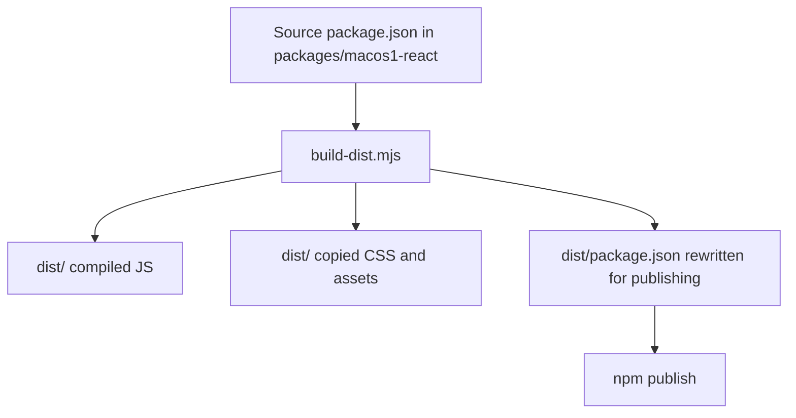

# Implementation guide for publishing macos1-react to npmjs

## Executive Summary

`@go-go-golems/macos1-react` is now the canonical presentational package for the extracted macos1 theme, base widget primitives, approved rich primitives, and presentational shell components. Today it is configured to publish to GitHub Packages, which means external consumers need GitHub-registry configuration and authentication. That is acceptable for internal monorepo packages, but it is the wrong friction profile for a public reusable React package.

The recommended implementation is:

1. publish `@go-go-golems/macos1-react` to **npmjs.org** as a public scoped package,
2. keep the existing GitHub Packages publishing flow for internal packages unchanged,
3. add a **separate npmjs release workflow** for `macos1-react`,
4. document clearly that **new public consumers should import `@go-go-golems/macos1-react` directly**, and
5. explicitly treat `@go-go-golems/os-core` as an internal/compatibility package until there is a later decision to also move it to npmjs or change scope strategy.

The most important conceptual point for interns is this:

- **public npmjs package** means consumers can install without a GitHub token
- it does **not** mean publishers can publish without authentication
- initial npmjs publishing still requires either an npm token or a trusted-publishing workflow

This ticket should not attempt a full registry migration for the entire `@go-go-golems` scope. It should solve the public-package problem for `macos1-react` only, while being honest about the cross-registry limitations that remain for `os-core`.

## Problem Statement

### Current state

The repository already has a packaging and publishing system for GitHub Packages. Relevant files:

- `/home/manuel/workspaces/2026-03-02/os-openai-app-server/wesen-os/workspace-links/go-go-os-frontend/packages/macos1-react/package.json`
- `/home/manuel/workspaces/2026-03-02/os-openai-app-server/wesen-os/workspace-links/go-go-os-frontend/packages/os-core/package.json`
- `/home/manuel/workspaces/2026-03-02/os-openai-app-server/wesen-os/workspace-links/go-go-os-frontend/scripts/packages/build-dist.mjs`
- `/home/manuel/workspaces/2026-03-02/os-openai-app-server/wesen-os/workspace-links/go-go-os-frontend/scripts/packages/publish-github-package.mjs`
- `/home/manuel/workspaces/2026-03-02/os-openai-app-server/wesen-os/workspace-links/go-go-os-frontend/scripts/packages/package-sets.mjs`
- `/home/manuel/workspaces/2026-03-02/os-openai-app-server/wesen-os/workspace-links/go-go-os-frontend/.github/workflows/publish-github-package-canary.yml`

`packages/macos1-react/package.json` currently contains:

- package name: `@go-go-golems/macos1-react`
- `publishConfig.registry = https://npm.pkg.github.com`
- proper `exports` pointing at `dist/*`
- `sideEffects` including CSS

`packages/os-core/package.json` now depends on:

- `@go-go-golems/macos1-react: workspace:*`

So `os-core` is no longer self-contained from a registry perspective.

### The practical problem

GitHub Packages is fine for internal/private package distribution, but it is awkward for a public reusable UI package because:

1. consumers need GitHub registry configuration,
2. consumers usually need GitHub authentication,
3. the install story is more complicated than normal npm usage,
4. docs become cluttered with registry setup instead of normal package usage,
5. public adoption is materially worse.

If we want `macos1-react` to feel like a real public package, it should live on **npmjs.org**, not GitHub Packages.

### The hidden compatibility problem

There is an additional subtlety: `macos1-react` and `os-core` use the same package scope:

- `@go-go-golems/macos1-react`
- `@go-go-golems/os-core`

npm registry configuration is usually scope-oriented. That means splitting packages with the **same scope** across **different registries** is operationally awkward.

Consequences:

- a new public consumer using only `@go-go-golems/macos1-react` can rely on normal npmjs resolution and is fine,
- an internal consumer configured to map `@go-go-golems` to GitHub Packages will not automatically fetch `macos1-react` from npmjs,
- a downstream consumer trying to mix `os-core` from GitHub Packages and `macos1-react` from npmjs under the same scope needs custom registry handling and should not be treated as the default public story.

That limitation must be documented, not hidden.

## Scope and Non-Goals

### In scope

This ticket should cover:

1. making `@go-go-golems/macos1-react` publishable to npmjs.org,
2. adding a release path for npmjs publication,
3. validating the packed artifact and install story,
4. documenting how new external consumers should install and import the package,
5. documenting the remaining limitations around `os-core` and same-scope cross-registry resolution.

### Explicitly not in scope

This ticket should **not** attempt to:

1. move the entire `@go-go-golems` scope from GitHub Packages to npmjs,
2. solve all cross-registry install cases for `os-core`,
3. publish `os-core` to npmjs in the same change,
4. rename the package or change scope,
5. redesign all existing publish tooling for every package in the repo.

Those may become later follow-up tickets.

## Current-State Packaging Architecture

### Development world versus publish world

Interns often get confused by the fact that source package manifests and published package manifests are not the same thing in this repo.

The repo works like this:



Important details:

- developers edit `packages/macos1-react/package.json`
- `build-dist.mjs` creates the real `dist/package.json`
- the actual publish command runs from `packages/macos1-react/dist`
- `workspace:*` dependencies are rewritten for publish output
- CSS side effects are copied into `dist/`

This matters because any npmjs solution must respect this existing `dist/`-first release model.

### Current publish scripts

The repo already has:

- `scripts/packages/publish-github-package.mjs`
- `scripts/packages/publish-github-package-set.mjs`
- `publish-github-package-canary.yml`

Despite the `github` naming, the single-package publish helper is not deeply tied to GitHub Packages in code. It mostly:

1. reads `dist/package.json`,
2. rewrites the version with an optional suffix,
3. runs `npm publish` from the package `dist/` directory.

That means the script can likely be reused, but its name is now misleading if it is used for npmjs publication.

## Proposed Solution

## Overview

Adopt a **parallel registry strategy**:

- `macos1-react` becomes a public npmjs package,
- the existing GitHub Packages flow remains for internal packages,
- public documentation teaches `macos1-react` as the canonical consumer package,
- `os-core` is kept as an internal compatibility/runtime package until a later migration decision.

### Package-level changes

Update `packages/macos1-react/package.json` so that its publish configuration targets npmjs.org instead of GitHub Packages.

Recommended shape:

```json
"publishConfig": {
  "registry": "https://registry.npmjs.org",
  "access": "public"
}
```

Why `access: public` matters:

- scoped packages on npmjs often need explicit public access at publish time
- it makes the intent unambiguous
- it prevents accidental private publication attempts for a scoped package

### Release-path changes

Add a dedicated **npmjs publishing workflow** rather than overloading the current GitHub Packages workflow.

Recommended new workflow name:

- `.github/workflows/publish-npmjs-macos1-react.yml`

Recommended characteristics:

- workflow_dispatch only at first
- targets `packages/macos1-react` only
- runs typecheck/test/build:dist/pack-smoke before publish
- uses an npm token or npm trusted publishing
- supports dry-run for rehearsals
- uses an npm tag such as `next`, `canary`, or `latest`

### Consumer guidance changes

Public docs should say:

- install `@go-go-golems/macos1-react` from npmjs.org,
- import `@go-go-golems/macos1-react/theme`,
- wrap usage in `Macos1Theme`,
- prefer subpath imports like `/primitives` and `/shell`.

Public docs should **not** present `os-core` as the primary package for new external consumers.

### Internal caveat documentation

Document clearly that:

- `os-core` still depends on `macos1-react`,
- `os-core` remains on GitHub Packages for now,
- cross-registry same-scope usage is not the simple public path,
- if a consumer needs `os-core`, that is still an internal/advanced scenario.

## Design Decisions

### Decision 1: Publish only `macos1-react` to npmjs in this ticket

**Chosen**: yes.

**Why**:

- it solves the immediate public-package need,
- it avoids a much larger registry migration,
- it keeps risk low,
- it matches the architectural decision that `macos1-react` is the canonical presentational package.

### Decision 2: Keep `os-core` on GitHub Packages for now

**Chosen**: yes.

**Why**:

- `os-core` still contains runtime/controller logic and internal stack concerns,
- moving it publicly is a separate product/release decision,
- a same-scope multi-registry caveat is easier to document than a rushed full migration.

### Decision 3: Use a separate npmjs workflow instead of mutating the GitHub workflow

**Chosen**: yes.

**Why**:

- it keeps existing internal release flows stable,
- it makes the registry target obvious,
- it reduces operator confusion,
- it allows npm-specific validation and secrets.

### Decision 4: Keep the `dist/`-first packaging model

**Chosen**: yes.

**Why**:

- it is already how the repo publishes,
- it properly captures CSS/assets and rewritten manifests,
- changing packaging and registry in one ticket would create unnecessary risk.

### Decision 5: Start with token-based npm publishing, not a full trusted-publishing redesign

**Chosen**: yes for initial implementation.

**Why**:

- it is operationally simpler for the first release,
- it minimizes unknowns,
- it matches what interns can validate step by step.

**Optional follow-up**:
- later move npmjs publication to trusted publishing if desired.

## Detailed Implementation Plan

### Phase 0: Explicit scope decision

Before coding, write down the release rule:

- `macos1-react` is the public package
- `os-core` remains internal/compatibility for now
- same-scope multi-registry limitations are accepted in the short term

If this decision is not written down, interns will accidentally try to make `os-core` public at the same time.

### Phase 1: Make the package manifest npmjs-ready

Edit:

- `/home/manuel/workspaces/2026-03-02/os-openai-app-server/wesen-os/workspace-links/go-go-os-frontend/packages/macos1-react/package.json`

Changes:

1. change `publishConfig.registry` from GitHub Packages to npmjs.org,
2. add `publishConfig.access = public`,
3. verify `main`, `types`, `exports`, and `sideEffects` remain correct,
4. verify README presence and package metadata quality.

Validation:

- `npm run build:dist -w packages/macos1-react`
- inspect `packages/macos1-react/dist/package.json`
- verify it points to `dist/*.js` and `dist/*.d.ts`

### Phase 2: Add or clarify local publish commands

There are two acceptable implementation styles.

#### Option A: reuse existing publish helper as-is

Use:

- `scripts/packages/publish-github-package.mjs`

Pros:

- minimal code changes
- faster

Cons:

- confusing name for npmjs publication

#### Option B: add a clearer wrapper or rename the helper

Possible choices:

- add `scripts/packages/publish-npm-package.mjs` as a thin wrapper
- or rename the helper to `publish-package.mjs` and update callers

Recommended for intern clarity:

- prefer **Option B** if time allows
- prefer **Option A** only if the goal is pure speed and low diff size

### Phase 3: Add an npmjs publish workflow

Create a new workflow, e.g.:

- `.github/workflows/publish-npmjs-macos1-react.yml`

Recommended behavior:

1. checkout
2. setup pnpm
3. setup node with npm registry url `https://registry.npmjs.org`
4. install dependencies
5. run `npm run typecheck -w packages/macos1-react`
6. run `npm run test -w packages/macos1-react`
7. run `npm run build:dist -w packages/macos1-react`
8. run a pack smoke check on `packages/macos1-react`
9. publish with dry-run support

Recommended inputs:

- `npm_tag`
- `version_suffix`
- `dry_run`

Recommended secrets/env:

- `NODE_AUTH_TOKEN: ${{ secrets.NPM_TOKEN }}`

Important intern note:

- even a **public** npmjs package still requires auth to publish
- public affects install visibility, not publisher authentication

### Phase 4: Add install/usage documentation

Update package docs so external consumers can understand usage without reading monorepo internals.

Targets may include:

- `/home/manuel/workspaces/2026-03-02/os-openai-app-server/wesen-os/workspace-links/go-go-os-frontend/packages/macos1-react/README.md`
- any docs site or ticket docs used for external guidance

Must explain:

1. install command from npmjs,
2. theme CSS import,
3. `Macos1Theme` wrapper usage,
4. subpath imports for primitives and shell,
5. note that `os-core` remains an internal/compatibility package.

### Phase 5: Validate external-consumer install path

Create a clean scratch consumer app outside the monorepo and verify:

```bash
pnpm add @go-go-golems/macos1-react
```

Then validate a minimal app:

```tsx
import '@go-go-golems/macos1-react/theme';
import { Macos1Theme } from '@go-go-golems/macos1-react';
import { Btn } from '@go-go-golems/macos1-react/primitives';
```

Acceptance criteria:

- install succeeds with no GitHub Packages config,
- CSS loads,
- theme wrapper works,
- component import paths work,
- bundler does not complain about missing CSS or exports.

### Phase 6: Record the known limitation around `os-core`

This phase is documentation, not code.

Document that a public consumer should **not** assume the following is the default supported setup:

- install `os-core` from GitHub Packages
- install `macos1-react` from npmjs
- use a single generic `@go-go-golems` scope registry mapping with no caveats

That is a valid advanced/internal scenario, not the simple public onboarding story.

## Suggested Workflow YAML Shape

The exact YAML can vary, but the intended structure is roughly:

```yaml
name: publish-npmjs-macos1-react

on:
  workflow_dispatch:
    inputs:
      npm_tag:
        required: true
        default: next
      version_suffix:
        required: false
        default: ''
      dry_run:
        required: true
        default: true
        type: boolean

jobs:
  publish:
    runs-on: ubuntu-latest
    steps:
      - checkout
      - setup pnpm
      - setup node for registry.npmjs.org
      - install
      - typecheck macos1-react
      - test macos1-react
      - build:dist macos1-react
      - pack smoke macos1-react
      - publish macos1-react with NODE_AUTH_TOKEN
```

## Validation Strategy

### Artifact validation

Run locally before touching the registry:

```bash
npm run build:dist -w packages/macos1-react
npm pack ./packages/macos1-react/dist
```

Check the tarball contains:

- `dist/theme/*`
- `dist/primitives/*`
- `dist/shell/*`
- CSS assets
- `package.json`
- `README.md`

### Install validation

Use a clean temporary project and verify:

- install from npmjs succeeds without GitHub `.npmrc`
- `theme` subpath resolves
- `primitives` subpath resolves
- `shell` subpath resolves

### Runtime validation

Render at least one small app with:

- `Macos1Theme`
- a primitive such as `Btn`
- theme CSS import

This avoids the common failure mode where publish succeeds but CSS side effects are missing.

## Risks and Failure Modes

### Risk 1: same-scope registry confusion

If internal docs or external docs continue to tell users to map `@go-go-golems` to GitHub Packages, then npmjs installs of `macos1-react` will be confusing.

Mitigation:

- keep public docs focused on direct npmjs install of `macos1-react`
- do not market cross-registry `os-core` usage as the public default

### Risk 2: publishing from the wrong manifest

An intern may try to publish from `packages/macos1-react/` instead of `packages/macos1-react/dist/`.

Mitigation:

- keep `build:dist` in the documented sequence
- keep the workflow publishing from `dist/`
- make the guide explicit that the source manifest is not the publish artifact

### Risk 3: forgetting `publishConfig.access`

For a scoped package on npmjs, forgetting `access: public` can produce confusing failures or wrong default behavior.

Mitigation:

- set it explicitly in `publishConfig`

### Risk 4: conflating public install with public publish

A common misunderstanding is:

> if the package is public, we do not need a token anymore

This is false.

Correct rule:

- consumers of a public npmjs package usually do not need a token
- publishers still need authentication

### Risk 5: trying to solve `os-core` in the same ticket

That expands scope too much and risks mixing release engineering with architecture cleanup.

Mitigation:

- keep `os-core` caveats documented
- defer broader registry strategy to a follow-up ticket

## Alternatives Considered

### Alternative 1: keep `macos1-react` on GitHub Packages only

Rejected because:

- it keeps install friction high,
- it is a poor public package experience,
- it does not match the goal of a publicly consumable React package.

### Alternative 2: move the entire `@go-go-golems` scope to npmjs at once

Rejected for this ticket because:

- it is much larger in scope,
- it affects many internal packages and workflows,
- it deserves its own migration plan.

### Alternative 3: publish `macos1-react` under a new public scope

Rejected for now because:

- it would create naming churn,
- it complicates compatibility messaging,
- there is no current evidence that the scope itself must change to ship the package publicly.

### Alternative 4: introduce npm trusted publishing immediately

Deferred because:

- it is extra release-engineering work,
- token-based publication is a simpler first implementation,
- trusted publishing can be a later hardening step.

## Implementation Plan

1. Update `packages/macos1-react/package.json` publishConfig to npmjs.org + public access.
2. Add a dedicated npmjs publish workflow for `packages/macos1-react`.
3. Decide whether to reuse or rename the existing single-package publish helper.
4. Add/update README guidance for public installs.
5. Run local `build:dist` and `npm pack` validation.
6. Run a dry-run publish workflow.
7. Publish a canary or `next` npmjs version.
8. Validate install from a clean external project.
9. Record the `os-core` cross-registry caveat explicitly.

## Open Questions

1. Do we want to keep `publish-github-package.mjs` as a generic helper despite the misleading name, or rename it now?
2. Should the first npmjs publication use an npm automation token, or do we want to set up trusted publishing immediately?
3. Do we want a public-facing README section that explicitly says `os-core` is not the recommended external entrypoint?
4. After `macos1-react` is public, do we want a follow-up ticket to move `os-core` and other compatible packages to npmjs as well?

## References

- `/home/manuel/workspaces/2026-03-02/os-openai-app-server/wesen-os/workspace-links/go-go-os-frontend/packages/macos1-react/package.json`
- `/home/manuel/workspaces/2026-03-02/os-openai-app-server/wesen-os/workspace-links/go-go-os-frontend/packages/os-core/package.json`
- `/home/manuel/workspaces/2026-03-02/os-openai-app-server/wesen-os/workspace-links/go-go-os-frontend/scripts/packages/build-dist.mjs`
- `/home/manuel/workspaces/2026-03-02/os-openai-app-server/wesen-os/workspace-links/go-go-os-frontend/scripts/packages/publish-github-package.mjs`
- `/home/manuel/workspaces/2026-03-02/os-openai-app-server/wesen-os/workspace-links/go-go-os-frontend/scripts/packages/package-sets.mjs`
- `/home/manuel/workspaces/2026-03-02/os-openai-app-server/wesen-os/workspace-links/go-go-os-frontend/.github/workflows/publish-github-package-canary.yml`
