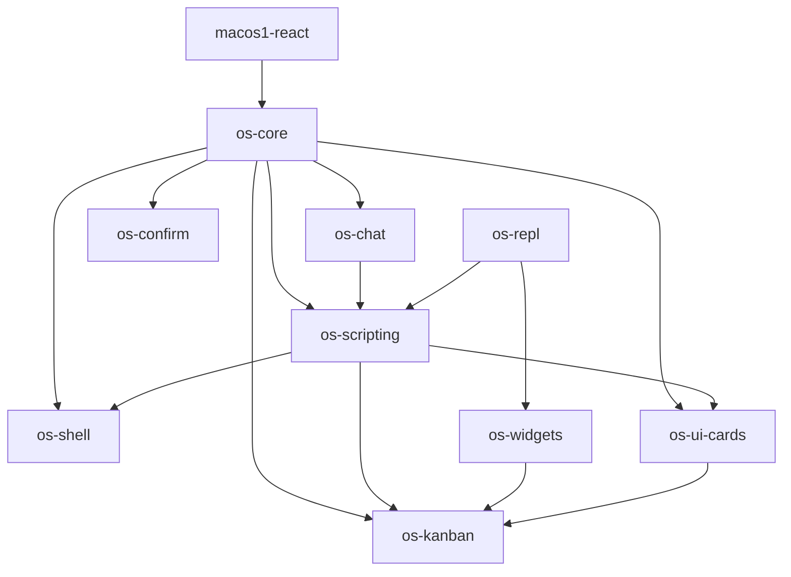

# Detailed guide for migrating published @go-go-golems libraries from GitHub Packages to npmjs

## Executive Summary

The cleanest way to avoid split-registry hacks is to migrate the entire published `@go-go-golems` **library** set — meaning the reusable packages under `workspace-links/go-go-os-frontend/packages/*` — from GitHub Packages to npmjs in one coordinated release, while explicitly excluding app packages from the migration scope.

This migration is primarily a **registry and release-engineering change**, not a UI architecture rewrite. The core packaging model in the repo is already good:

- packages are developed from source manifests inside the monorepo,
- `build:dist` produces a publishable `dist/` artifact with rewritten manifests,
- publication happens from `dist/`, not from raw source,
- downstream app repos can already switch between workspace-local and published package resolution.

The main problem today is registry topology. Right now all published library packages in the frontend workspace point at GitHub Packages. That becomes awkward as soon as one package is supposed to be public and easy to install, because all packages share the same `@go-go-golems` scope. Splitting one package onto npmjs while leaving the rest on GitHub Packages forces scope-level registry hacks into consumer repos. Migrating the full reusable library set together avoids that entire class of problems.

The second important conclusion is about deployment and federated remotes on k3s:

- the **k3s host runtime** does not fetch npm packages directly at runtime,
- it serves a compiled launcher image and, separately, loads remote manifests and remote chunks from object storage,
- therefore npmjs migration mostly affects the **build-time dependency installation** for source app repos like inventory and sqlite,
- it does **not** fundamentally change the runtime remote-manifest loading contract used by the host.

So the recommended implementation is:

1. move all published non-app `@go-go-golems` library packages in `go-go-os-frontend/packages/*` to npmjs.org,
2. keep the `dist/`-first publish pipeline,
3. add an npmjs-oriented package-set workflow for the full library stack,
4. update downstream federated app source repos to install published platform libraries from npmjs,
5. validate that federated app builds still produce the same remote artifacts,
6. validate that the k3s host still loads those remote artifacts exactly as before.

This document explains the current system in detail for a new intern, including the package graph, the publish artifact pipeline, the deployment planes, the federated remote release flow, the migration phases, and the most likely failure modes.

> [!summary]
> - Do **not** move only one package in this scope to npmjs; move the whole reusable library set together.
> - The migration target is **all non-app packages** under `workspace-links/go-go-os-frontend/packages/*`.
> - Keep the current `build:dist` packaging model; only change registry targets, workflow paths, and downstream consumer configuration.
> - Federated apps on k3s are impacted mostly at **build/install time**, not in the host’s runtime manifest-loading plane.
> - The host runtime still loads remotes via `/api/os/federation-registry` → manifest URL → object storage JS chunks, not via npm.

## Problem Statement

### What is the actual problem?

The repository currently publishes reusable frontend libraries under the `@go-go-golems` scope to GitHub Packages. That is workable for internal distribution but is the wrong friction profile for a public package ecosystem.

A public consumer should ideally be able to:

```bash
pnpm add @go-go-golems/os-core @go-go-golems/os-shell @go-go-golems/macos1-react
```

without any GitHub Packages `.npmrc` configuration, GitHub token, or custom registry setup.

That is not the current story.

### Why a one-package move is the wrong shape

All reusable libraries in the current frontend package family share the same scope:

- `@go-go-golems/macos1-react`
- `@go-go-golems/os-core`
- `@go-go-golems/os-chat`
- `@go-go-golems/os-confirm`
- `@go-go-golems/os-repl`
- `@go-go-golems/os-scripting`
- `@go-go-golems/os-shell`
- `@go-go-golems/os-ui-cards`
- `@go-go-golems/os-widgets`
- `@go-go-golems/os-kanban`

Registry configuration for npm clients is usually scope-level, not package-level. So a mixed arrangement like:

- `@go-go-golems/macos1-react` on npmjs
- all other `@go-go-golems/*` libraries on GitHub Packages

creates a bad consumer experience and awkward documentation.

### Why the scope-wide library migration is cleaner

If all reusable published libraries under the scope move together, then:

- one scope maps to one registry,
- one install story works for consumers,
- one release workflow family can serve the library stack,
- downstream app repos that consume published platform versions become simpler,
- package documentation stops having to explain split-registry exceptions.

## Scope

### In scope

This ticket covers **all published library packages** in:

- `/home/manuel/workspaces/2026-03-02/os-openai-app-server/wesen-os/workspace-links/go-go-os-frontend/packages/*`

At the time of writing, the package inventory is:

1. `@go-go-golems/macos1-react`
2. `@go-go-golems/os-chat`
3. `@go-go-golems/os-confirm`
4. `@go-go-golems/os-core`
5. `@go-go-golems/os-kanban`
6. `@go-go-golems/os-repl`
7. `@go-go-golems/os-scripting`
8. `@go-go-golems/os-shell`
9. `@go-go-golems/os-ui-cards`
10. `@go-go-golems/os-widgets`

This ticket also covers the downstream **source app repos** that install these libraries from a registry during CI in order to build federated remotes, especially:

- `/home/manuel/workspaces/2026-03-02/os-openai-app-server/wesen-os/workspace-links/go-go-app-inventory`
- `/home/manuel/workspaces/2026-03-02/os-openai-app-server/wesen-os/workspace-links/go-go-app-sqlite`

### Explicitly out of scope

This ticket does **not** migrate app packages themselves to npmjs. App packages remain app repos or app-specific bundles. Examples out of scope:

- `workspace-links/go-go-os-frontend/apps/*`
- `workspace-links/go-go-app-inventory/apps/inventory`
- `workspace-links/go-go-app-sqlite/apps/sqlite`
- `apps/os-launcher`

The ticket also does **not** redesign module federation, k3s deployment, or GitOps itself. It only documents how those systems are affected by the registry migration.

## Current-State Analysis

## 1. Current published package set

The reusable package set is defined physically by the directories under:

- `/home/manuel/workspaces/2026-03-02/os-openai-app-server/wesen-os/workspace-links/go-go-os-frontend/packages`

Each current package manifest contains a `publishConfig.registry` pointing at GitHub Packages.

Observed package manifests include:

- `packages/macos1-react/package.json`
- `packages/os-core/package.json`
- `packages/os-chat/package.json`
- `packages/os-confirm/package.json`
- `packages/os-kanban/package.json`
- `packages/os-repl/package.json`
- `packages/os-scripting/package.json`
- `packages/os-shell/package.json`
- `packages/os-ui-cards/package.json`
- `packages/os-widgets/package.json`

Current publish target in each case is:

```json
"publishConfig": {
  "registry": "https://npm.pkg.github.com"
}
```

### Important subtlety: `private: true` in source manifests

An intern will notice that these source manifests still say `private: true`.

That does **not** mean the repo lacks a publish flow.

The reason is that the repo publishes from generated `dist/` artifacts, not directly from the source manifest. The relevant script is:

- `/home/manuel/workspaces/2026-03-02/os-openai-app-server/wesen-os/workspace-links/go-go-os-frontend/scripts/packages/build-dist.mjs`

That script generates a new `dist/package.json` containing the fields needed for publication.

## 2. Current packaging pipeline

The root frontend workspace package scripts are in:

- `/home/manuel/workspaces/2026-03-02/os-openai-app-server/wesen-os/workspace-links/go-go-os-frontend/package.json`

Notable scripts:

- `build:publish-v1`
- `pack:smoke-v1`
- `install:smoke-v1`

Current `build:publish-v1` builds `dist/` artifacts for the published packages in sequence.

The current `build-dist.mjs` script performs the key publish-artifact transformation. Relevant responsibilities visible in the script include:

- reading the source `package.json`
- rewriting runtime and type targets for `exports`, `main`, and `types`
- rewriting dependency maps from workspace specs to concrete versions
- writing `dist/package.json`
- copying CSS/assets and README into `dist/`

This means the packaging model is already suitable for npmjs. The migration does **not** need a full packaging rewrite.

## 3. Current publish helpers and workflows

The current single-package publish helper is:

- `/home/manuel/workspaces/2026-03-02/os-openai-app-server/wesen-os/workspace-links/go-go-os-frontend/scripts/packages/publish-github-package.mjs`

The current package-set helper is:

- `/home/manuel/workspaces/2026-03-02/os-openai-app-server/wesen-os/workspace-links/go-go-os-frontend/scripts/packages/publish-github-package-set.mjs`

The current package-set definitions are in:

- `/home/manuel/workspaces/2026-03-02/os-openai-app-server/wesen-os/workspace-links/go-go-os-frontend/scripts/packages/package-sets.mjs`

The current GitHub workflow is:

- `/home/manuel/workspaces/2026-03-02/os-openai-app-server/wesen-os/workspace-links/go-go-os-frontend/.github/workflows/publish-github-package-canary.yml`

The key observation is that the scripts are **behaviorally close to registry-agnostic**, but they are named and configured around GitHub Packages. That is mostly a naming and workflow configuration problem, not an architecture blocker.

## 4. Current dependency graph inside the published library stack

The observed dependency graph from the package manifests looks like this.



This graph is exactly why a coordinated migration is easier than ad hoc package exceptions. The packages are not isolated; they are a versioned family.

### Practical consequence

When publishing this library set publicly, the releases should generally remain **coordinated** and should share a common version or prerelease suffix during rollout.

## 5. The system has three delivery planes, not one

A new intern will get confused unless the system is split into its real delivery planes.

### Plane A — npm package plane

This is the reusable library plane.

Artifacts:

- `@go-go-golems/os-core`
- `@go-go-golems/os-shell`
- `@go-go-golems/os-scripting`
- `@go-go-golems/macos1-react`
- related libraries

How consumed:

- installed by npm/pnpm at build time
- used by downstream library consumers and by source app repos

### Plane B — host image plane

This is the deployed `wesen-os` launcher image.

Key files:

- `/home/manuel/workspaces/2026-03-02/os-openai-app-server/wesen-os/Dockerfile`
- `/home/manuel/workspaces/2026-03-02/os-openai-app-server/wesen-os/.github/workflows/deploy-host-to-k3s.yml`
- `/home/manuel/workspaces/2026-03-02/os-openai-app-server/wesen-os/deploy/k8s/wesen-os/deployment.yaml`

This plane builds and deploys the launcher binary/container to k3s.

### Plane C — federated remote asset plane

This is the module-federation-style remote delivery path.

Key files:

- `/home/manuel/workspaces/2026-03-02/os-openai-app-server/wesen-os/apps/os-launcher/src/app/federationRegistry.ts`
- `/home/manuel/workspaces/2026-03-02/os-openai-app-server/wesen-os/apps/os-launcher/src/app/loadFederatedAppContracts.ts`
- `/home/manuel/workspaces/2026-03-02/os-openai-app-server/wesen-os/cmd/wesen-os-launcher/federation_registry_endpoint.go`
- `/home/manuel/workspaces/2026-03-02/os-openai-app-server/wesen-os/deploy/k8s/wesen-os/configmap.yaml`
- `/home/manuel/workspaces/2026-03-02/os-openai-app-server/wesen-os/workspace-links/go-go-app-inventory/.github/workflows/publish-federation-remote.yml`
- `/home/manuel/workspaces/2026-03-02/os-openai-app-server/wesen-os/workspace-links/go-go-app-sqlite/.github/workflows/publish-federation-remote.yml`

Artifacts:

- `mf-manifest.json`
- remote JS entry/chunk assets in object storage
- a host-served registry at `/api/os/federation-registry`

### Why this distinction matters

The npmjs migration strongly affects **Plane A**, indirectly affects the **build inputs of Plane C**, and only weakly affects **Plane B** and the **runtime mechanics of Plane C**.

## 6. Current federated remote and k3s flow

The existing federation documentation already describes the delivery model well. The important current shape is visible both in code and in prior ticket docs.

### Runtime registry flow inside the host

The launcher bootstraps remote loading through:

- `loadFederatedRemoteRegistry()` in `apps/os-launcher/src/app/federationRegistry.ts`
- `loadFederatedAppContracts()` in `apps/os-launcher/src/app/loadFederatedAppContracts.ts`

The relevant runtime behavior is:

1. try to load explicit env-driven registry information,
2. otherwise fetch `/api/os/federation-registry`,
3. parse entries with mode `remote-manifest`,
4. fetch `mf-manifest.json`,
5. compute the remote entry URL,
6. dynamic-import the remote entry,
7. load the host contract export.

Pseudocode for the runtime plane:

```text
registry = load registry config
for each enabled remote:
  if mode == local-package:
    load contract from locally bundled package
  if mode == remote-manifest:
    fetch manifestUrl
    parse manifest.contract.entry
    dynamic import remote entry URL
    load host contract
```

### Backend endpoint serving the registry

The endpoint in:

- `cmd/wesen-os-launcher/federation_registry_endpoint.go`

simply reads a configured JSON file from disk and serves it at:

- `/api/os/federation-registry`

If the file path is missing, it returns `404`.

### K3s deployment wiring

The k3s deployment passes:

- `--federation-registry=/config/federation.registry.json`

through:

- `deploy/k8s/wesen-os/deployment.yaml`

The actual mounted content is provided from:

- `deploy/k8s/wesen-os/configmap.yaml`

That configmap currently embeds `federation.registry.json` with remote-manifest URLs such as object-storage URLs for inventory.

### Important conclusion for the migration

The host runtime does **not** install npm packages in production in order to load federated remotes.

Instead, it loads:

- a registry JSON file
- a manifest URL
- remote JS assets from object storage

Therefore, migrating libraries to npmjs does **not** directly change how k3s hosts fetch remote app bundles at runtime.

It changes the dependency installation path in the **source app repos that build those remotes**.

## Gap Analysis

### Gap 1: registry topology is wrong for public libraries

Current state:

- all reusable libraries publish to GitHub Packages

Desired state:

- all reusable public libraries publish to npmjs

### Gap 2: current workflow naming and configuration are GitHub-Packages-centric

Current state:

- `publish-github-package*.mjs`
- `publish-github-package-canary.yml`

Desired state:

- generic or npmjs-specific workflows/helpers for the public library set

### Gap 3: downstream federated app repos assume GitHub Packages for published platform versions

Observed in both inventory and sqlite federation workflows:

- `actions/setup-node` points at `https://npm.pkg.github.com`
- `.npmrc` is written for `@go-go-golems` → GitHub Packages
- `platform_version` is described as a GitHub Packages version
- install steps rely on GitHub token-backed package reads

Desired state:

- published platform versions come from npmjs
- install steps do not need GitHub Packages auth for these libraries

### Gap 4: no unified package-set migration plan exists

Current state:

- package sets are tuned to current GitHub publication
- there is no clear intern-facing inventory and release order for the full public library family

Desired state:

- a topologically valid public-library release set
- clear docs and automation for dry-run, prerelease, and full release

## Proposed Solution

## High-level strategy

Migrate the full library package family in one coordinated release window.

That means:

1. switch every published library package under `go-go-os-frontend/packages/*` to npmjs.org,
2. add a public-library package set and npmjs publish workflow,
3. keep `build:dist` as the canonical packaging mechanism,
4. update dependent source app repos to install platform versions from npmjs,
5. keep app packages and host images out of npmjs migration scope,
6. verify that federated remote outputs and host runtime behavior remain unchanged.

## Proposed package migration set

The migration set is the full reusable library family:

1. `@go-go-golems/macos1-react`
2. `@go-go-golems/os-core`
3. `@go-go-golems/os-chat`
4. `@go-go-golems/os-confirm`
5. `@go-go-golems/os-repl`
6. `@go-go-golems/os-scripting`
7. `@go-go-golems/os-shell`
8. `@go-go-golems/os-ui-cards`
9. `@go-go-golems/os-widgets`
10. `@go-go-golems/os-kanban`

### Recommended publish order

A safe coordinated order is:

1. `macos1-react`
2. `os-core`
3. `os-chat`
4. `os-repl`
5. `os-scripting`
6. `os-ui-cards`
7. `os-confirm`
8. `os-shell`
9. `os-widgets`
10. `os-kanban`

This order is not the only valid topological sort, but it respects the visible dependency graph and matches the current packaging family reasonably well.

## Proposed registry changes

For each package manifest in `workspace-links/go-go-os-frontend/packages/*/package.json`:

```json
"publishConfig": {
  "registry": "https://registry.npmjs.org",
  "access": "public"
}
```

### Why `access: public` should be explicit

Because these are scoped packages, explicitly setting public access avoids ambiguity during publish and makes operator intent obvious.

## Proposed workflow changes

### 1. Add a public-library package set

Update:

- `workspace-links/go-go-os-frontend/scripts/packages/package-sets.mjs`

Add a set such as:

- `public-libraries`

with the ordered package list above.

### 2. Add an npmjs publishing workflow

Create a workflow such as:

- `workspace-links/go-go-os-frontend/.github/workflows/publish-npmjs-public-libraries.yml`

This workflow should:

1. accept `package_set`, `npm_tag`, `version_suffix`, and `dry_run`
2. run typecheck/test/build:dist for the selected set
3. run pack-smoke/install-smoke where appropriate
4. publish from `dist/` using npmjs auth

### 3. Consider renaming generic publish helpers

The current helper names are misleading once npmjs becomes a first-class target.

Recommended cleanup:

- `publish-github-package.mjs` → `publish-package.mjs`
- `publish-github-package-set.mjs` → `publish-package-set.mjs`

This is not strictly required for functionality, but it materially improves intern clarity.

## Proposed downstream source-repo changes

### Inventory remote source repo

Current file:

- `workspace-links/go-go-app-inventory/.github/workflows/publish-federation-remote.yml`

Current workflow behavior:

- resolves a published `platform_version`
- rewrites selected platform dependencies in `apps/inventory/package.json`
- configures `@go-go-golems` scope to GitHub Packages
- installs dependencies from GitHub Packages
- builds `dist-federation`
- uploads immutable remote assets to object storage
- opens a GitOps PR updating the host registry target

Required migration changes:

- change `actions/setup-node` registry-url to npmjs or remove scope-specific GitHub config,
- remove GitHub Packages `.npmrc` setup for the platform libs,
- update wording from “install from GitHub Packages” to “install published platform version”,
- ensure `platform_version` resolves against npmjs-published versions,
- keep the federation upload and GitOps update logic unchanged.

### SQLite remote source repo

Current file:

- `workspace-links/go-go-app-sqlite/.github/workflows/publish-federation-remote.yml`

The same migration shape applies.

### Why this matters

The federated remote plane uses published platform libraries at **build time**. If these source repos remain pointed at GitHub Packages while the libraries move to npmjs, remote builds will fail even though the runtime host is still perfectly fine.

## How k3s and federated modules are impacted

This needs its own explicit explanation because it is easy to misunderstand.

## The host runtime is mostly unaffected

At runtime, the deployed host on k3s does **not** ask npm for `@go-go-golems/os-core` or `@go-go-golems/macos1-react`.

Instead, the runtime host:

1. starts the compiled `wesen-os` launcher image,
2. serves `/api/os/federation-registry`,
3. fetches remote manifest URLs from that registry,
4. loads remote JS from object storage.

So the runtime contract is:

```mermaid
flowchart LR
  A[k3s host deployment] --> B[/api/os/federation-registry]
  B --> C[mf-manifest.json in object storage]
  C --> D[remote JS entry/chunks]
  D --> E[loaded federated app host contract]
```

npm registry migration does **not** directly change this runtime chain.

## The build inputs for remote source repos are impacted

The inventory/sqlite source repos build their remotes using published platform packages. That means the migration affects their CI dependency resolution.

Those repos need:

- new registry configuration
- possibly simplified `.npmrc`
- possibly simplified auth handling
- updated docs and workflow help text

## The host image plane is operationally adjacent, not the same thing

The k3s host deployment itself is driven by:

- `Dockerfile`
- `.github/workflows/deploy-host-to-k3s.yml`
- `deploy/k8s/wesen-os/*`

That plane remains mostly unchanged by the registry migration, because the host image builds from the local monorepo/workspace, not from published packages.

However, there is still an indirect risk:

- if remote source repos fail to build against the migrated npmjs packages,
- then no new valid federation artifacts are published,
- then the host’s registry may point at stale manifests,
- which looks like a deployment problem even though the real issue is upstream package resolution.

### Practical rule

After the npmjs migration, always validate both:

1. the public library publish/install path, and
2. at least one federated source-repo build path (inventory or sqlite).

## Design Decisions

### Decision 1: migrate all non-app libraries together

**Chosen**: yes.

**Why**:

- avoids same-scope split-registry hacks,
- simplifies consumer docs,
- simplifies downstream CI configuration,
- matches the user requirement that all things except app packages are public.

### Decision 2: keep app packages out of migration scope

**Chosen**: yes.

**Why**:

- apps are not the public reusable library surface,
- app deployment is a different delivery plane,
- mixing app release strategy with library registry migration adds unnecessary scope.

### Decision 3: keep the dist-first packaging model

**Chosen**: yes.

**Why**:

- it already works,
- it handles CSS/assets and manifest rewriting correctly,
- changing both packaging architecture and registry in one ticket is unnecessary risk.

### Decision 4: update downstream federated source repos in the same migration

**Chosen**: yes.

**Why**:

- these repos depend on published platform versions for their federation builds,
- leaving them on GitHub Packages would break remote CI,
- this is the main real-world impact beyond the library repo itself.

### Decision 5: treat host runtime validation as required, but not as a redesign

**Chosen**: yes.

**Why**:

- runtime behavior should remain the same,
- but we still need evidence that the new library publish path does not indirectly break remote artifact generation.

## API and File Surface Reference

### Library packaging and publish files

- `workspace-links/go-go-os-frontend/package.json`
- `workspace-links/go-go-os-frontend/scripts/packages/build-dist.mjs`
- `workspace-links/go-go-os-frontend/scripts/packages/publish-github-package.mjs`
- `workspace-links/go-go-os-frontend/scripts/packages/publish-github-package-set.mjs`
- `workspace-links/go-go-os-frontend/scripts/packages/package-sets.mjs`
- `workspace-links/go-go-os-frontend/.github/workflows/publish-github-package-canary.yml`

### Host deployment and federation files

- `Dockerfile`
- `.github/workflows/deploy-host-to-k3s.yml`
- `deploy/k8s/wesen-os/deployment.yaml`
- `deploy/k8s/wesen-os/configmap.yaml`
- `cmd/wesen-os-launcher/federation_registry_endpoint.go`
- `apps/os-launcher/src/app/federationRegistry.ts`
- `apps/os-launcher/src/app/loadFederatedAppContracts.ts`

### Downstream source repos with published-platform install paths

- `workspace-links/go-go-app-inventory/.github/workflows/publish-federation-remote.yml`
- `workspace-links/go-go-app-inventory/deploy/federation-gitops-targets.json`
- `workspace-links/go-go-app-sqlite/.github/workflows/publish-federation-remote.yml`

## Pseudocode and Migration Flows

## 1. Public library publish flow after migration

```text
for each package in public library package set:
  run build:dist
  verify dist/package.json
  verify pack/install smoke
publish all packages to npmjs using coordinated version or prerelease suffix
```

## 2. Downstream federated source repo build flow after migration

```text
resolve platform_version
rewrite app package.json dependencies to published platform version
npm install from npmjs
build dist-federation
upload immutable manifest/chunks to object storage
open GitOps PR to update host federation registry target
merge PR
host loads new manifest URL at runtime
```

## 3. Runtime host loading flow (unchanged)

```text
browser bootstraps launcher
launcher fetches /api/os/federation-registry
launcher sees remote-manifest entry
launcher fetches mf-manifest.json
launcher resolves remote entry URL
launcher dynamic-imports remote entry module
launcher registers remote contract
```

## Detailed Implementation Plan

## Phase 0 — Decide and document the migration boundary

Write down the rule clearly in the ticket and docs:

- **all packages under `go-go-os-frontend/packages/*` are public library packages**
- **app packages are not part of the npmjs migration set**

If this is not stated first, an intern will repeatedly second-guess which directories belong in the migration.

## Phase 1 — Package inventory and publish order

Create an explicit table in code/docs of the library package set and the publish order.

Tasks:

- inventory all package names,
- confirm the topological dependency order,
- define a public-library package set in `package-sets.mjs`,
- add a canonical release order to the docs.

## Phase 2 — Switch package manifests to npmjs

For each package under `workspace-links/go-go-os-frontend/packages/*/package.json`:

1. change `publishConfig.registry` to `https://registry.npmjs.org`,
2. add `publishConfig.access = "public"`,
3. verify metadata quality for public publication,
4. run `build:dist`,
5. inspect the generated `dist/package.json`.

Important intern note:

- do **not** publish from the source package directory
- do **not** assume `private: true` in source blocks the existing dist-first publish flow

## Phase 3 — Add npmjs release automation

Introduce a workflow dedicated to npmjs publication of the public library package set.

Recommended behavior:

1. accept `package_set`, `npm_tag`, `version_suffix`, `dry_run`,
2. build all selected `dist/` artifacts,
3. run pack smoke and install smoke,
4. publish with npm auth,
5. keep current GitHub Packages workflow only if it is still needed during transition.

Recommended cleanup:

- rename publish helpers to neutral names if time allows
- otherwise add comments documenting that they are registry-agnostic even if the old names remain temporarily

## Phase 4 — Update docs for public consumption

Update package READMEs and onboarding docs so that new consumers are told to install from npmjs.

The docs should teach:

- normal `pnpm add` install flow,
- theme CSS imports,
- recommended direct use of `macos1-react` for presentational UI,
- compatibility expectations for packages like `os-core`.

## Phase 5 — Update downstream federated source-repo workflows

This is the most important non-obvious phase after the package manifests themselves.

For inventory/sqlite source repos:

- change `actions/setup-node` away from GitHub Packages registry settings for the public library packages,
- remove or reduce GitHub Packages auth setup,
- update workflow input/help text,
- ensure `platform_version` now refers to npmjs-published platform versions,
- rerun remote build and artifact publish dry-runs.

## Phase 6 — Validate public install path

Use a clean scratch project outside the monorepo to verify:

```bash
pnpm add @go-go-golems/macos1-react @go-go-golems/os-core
```

Then verify:

- direct theme imports work,
- CSS side effects are present,
- subpath imports work,
- no GitHub Packages `.npmrc` is required.

## Phase 7 — Validate federated remote build path

Use at least one source repo, ideally both inventory and sqlite.

Required checks:

- install published platform versions from npmjs,
- build `dist-federation`,
- dry-run upload to object storage,
- dry-run GitOps patch/update,
- confirm produced manifest URL shape is unchanged.

## Phase 8 — Validate host runtime remains unchanged

Required checks:

- verify k3s host still serves `/api/os/federation-registry`,
- verify the host can still load at least one remote-manifest contract,
- verify remote manifest URLs and object-storage paths are unaffected by the registry migration.

## Test Strategy

### Package-level tests

For every package in the public set:

- `npm run typecheck -w <package>`
- `npm run test -w <package>` when a test script exists
- `npm run build:dist -w <package>`
- `npm pack ./packages/<name>/dist`

### Consumer install smoke

In a scratch project:

- install from npmjs prerelease or tarball
- import top-level and subpath exports
- render a small UI for `macos1-react`

### Federated source-repo smoke

For inventory/sqlite:

- rewrite platform deps to published versions
- install from npmjs
- `build:federation`
- dry-run remote publish
- dry-run GitOps PR helper

### Host runtime smoke

- confirm `/api/os/federation-registry` still responds with expected manifest URLs
- confirm launcher runtime can load a remote-manifest contract from object storage

## Risks

### Risk 1: partial migration leaves some library packages on GitHub Packages

This recreates the split-registry scope problem and defeats the purpose of the coordinated move.

Mitigation:

- migrate the entire public library set together
- enforce one package-set workflow for the migration

### Risk 2: downstream source repos still assume GitHub Packages

This will break federated remote builds even if the library repo itself looks fine.

Mitigation:

- explicitly include inventory/sqlite workflow updates in the migration
- validate them before declaring the migration done

### Risk 3: runtime deploy debugging gets confused with build-time registry breakage

A failed federated remote build can look like a k3s or host runtime problem later.

Mitigation:

- preserve the three-plane mental model in all docs and triage steps
- validate Plane A and Plane C build flows before blaming Plane B

### Risk 4: publish helper naming confusion

Interns may mistake `publish-github-package.mjs` for a GitHub-only implementation.

Mitigation:

- rename it or document it aggressively

### Risk 5: version coordination failures across package family

Because these packages form a dependency graph, inconsistent prerelease versions can produce broken dependency resolution.

Mitigation:

- use coordinated version suffixes for the full package set
- publish the whole set in one controlled release window

## Alternatives Considered

### Alternative 1: move only `macos1-react`

Rejected because:

- same-scope split-registry setup is ugly,
- consumer docs become hacky,
- downstream package graph remains confusing.

### Alternative 2: keep everything on GitHub Packages

Rejected because:

- public consumption remains friction-heavy,
- normal npm onboarding is worse than necessary,
- it does not match the goal that all non-app packages should be public.

### Alternative 3: move apps and libraries together

Rejected because:

- app deployment is a separate delivery plane,
- apps are not the reusable public library surface,
- this creates extra release-scope churn without solving the core registry problem better.

### Alternative 4: redesign module federation and k3s rollout in the same ticket

Rejected because:

- the runtime federation path is not the root problem,
- the registry migration mainly affects build-time consumers,
- keeping runtime-plane behavior stable is preferable.

## Open Questions

1. Do we want to rename the publish helper scripts now, or defer the rename until after the npmjs migration is stable?
2. Do we want a single `public-libraries` npmjs workflow, or several curated package-set workflows?
3. Should the first npmjs publication use an npm token workflow or trusted publishing?
4. After the migration, do we still need GitHub Packages publication for any of these libraries, or can that path be removed entirely?

## References

### Core package and release files

- `/home/manuel/workspaces/2026-03-02/os-openai-app-server/wesen-os/workspace-links/go-go-os-frontend/package.json`
- `/home/manuel/workspaces/2026-03-02/os-openai-app-server/wesen-os/workspace-links/go-go-os-frontend/scripts/packages/build-dist.mjs`
- `/home/manuel/workspaces/2026-03-02/os-openai-app-server/wesen-os/workspace-links/go-go-os-frontend/scripts/packages/publish-github-package.mjs`
- `/home/manuel/workspaces/2026-03-02/os-openai-app-server/wesen-os/workspace-links/go-go-os-frontend/scripts/packages/package-sets.mjs`
- `/home/manuel/workspaces/2026-03-02/os-openai-app-server/wesen-os/workspace-links/go-go-os-frontend/.github/workflows/publish-github-package-canary.yml`

### Package manifests

- `/home/manuel/workspaces/2026-03-02/os-openai-app-server/wesen-os/workspace-links/go-go-os-frontend/packages/macos1-react/package.json`
- `/home/manuel/workspaces/2026-03-02/os-openai-app-server/wesen-os/workspace-links/go-go-os-frontend/packages/os-core/package.json`
- `/home/manuel/workspaces/2026-03-02/os-openai-app-server/wesen-os/workspace-links/go-go-os-frontend/packages/os-chat/package.json`
- `/home/manuel/workspaces/2026-03-02/os-openai-app-server/wesen-os/workspace-links/go-go-os-frontend/packages/os-confirm/package.json`
- `/home/manuel/workspaces/2026-03-02/os-openai-app-server/wesen-os/workspace-links/go-go-os-frontend/packages/os-kanban/package.json`
- `/home/manuel/workspaces/2026-03-02/os-openai-app-server/wesen-os/workspace-links/go-go-os-frontend/packages/os-repl/package.json`
- `/home/manuel/workspaces/2026-03-02/os-openai-app-server/wesen-os/workspace-links/go-go-os-frontend/packages/os-scripting/package.json`
- `/home/manuel/workspaces/2026-03-02/os-openai-app-server/wesen-os/workspace-links/go-go-os-frontend/packages/os-shell/package.json`
- `/home/manuel/workspaces/2026-03-02/os-openai-app-server/wesen-os/workspace-links/go-go-os-frontend/packages/os-ui-cards/package.json`
- `/home/manuel/workspaces/2026-03-02/os-openai-app-server/wesen-os/workspace-links/go-go-os-frontend/packages/os-widgets/package.json`

### Host and federation runtime files

- `/home/manuel/workspaces/2026-03-02/os-openai-app-server/wesen-os/Dockerfile`
- `/home/manuel/workspaces/2026-03-02/os-openai-app-server/wesen-os/.github/workflows/deploy-host-to-k3s.yml`
- `/home/manuel/workspaces/2026-03-02/os-openai-app-server/wesen-os/deploy/k8s/wesen-os/configmap.yaml`
- `/home/manuel/workspaces/2026-03-02/os-openai-app-server/wesen-os/deploy/k8s/wesen-os/deployment.yaml`
- `/home/manuel/workspaces/2026-03-02/os-openai-app-server/wesen-os/cmd/wesen-os-launcher/federation_registry_endpoint.go`
- `/home/manuel/workspaces/2026-03-02/os-openai-app-server/wesen-os/apps/os-launcher/src/app/federationRegistry.ts`
- `/home/manuel/workspaces/2026-03-02/os-openai-app-server/wesen-os/apps/os-launcher/src/app/loadFederatedAppContracts.ts`

### Downstream source-repo release paths

- `/home/manuel/workspaces/2026-03-02/os-openai-app-server/wesen-os/workspace-links/go-go-app-inventory/.github/workflows/publish-federation-remote.yml`
- `/home/manuel/workspaces/2026-03-02/os-openai-app-server/wesen-os/workspace-links/go-go-app-inventory/deploy/federation-gitops-targets.json`
- `/home/manuel/workspaces/2026-03-02/os-openai-app-server/wesen-os/workspace-links/go-go-app-sqlite/.github/workflows/publish-federation-remote.yml`
- `/home/manuel/workspaces/2026-03-02/os-openai-app-server/wesen-os/ttmp/2026/03/31/FEDERATION-RELEASE-001--generalize-remote-publish-and-gitops-handoff/design/02-generalized-federated-remote-release-guide.md`
